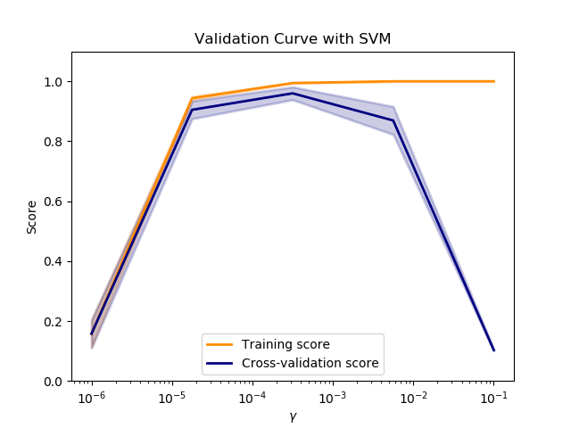
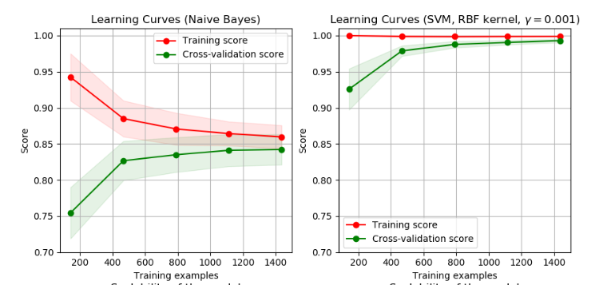

```{r setup, echo=F, purl=F}
knitr::opts_knit$set(root.dir = getwd())
knitr::opts_chunk$set(echo = TRUE, results = 'hide')
knitr::opts_chunk$set(warning = FALSE, message=FALSE)
knitr::opts_chunk$set(fig.align="center"
                      ## ,out.width="0.9\\textwidth" # latex
                      ,out.width="80%" # for both latex and html
                      ,fig.width=5, fig.height=3
                      )
```

```{r prepare, echo=F, purl=F}
rm(list=ls())
options(digits=4)
options(scipen=100)
graphics.off()
Sys.setlocale("LC_ALL", "Chinese")
library(reticulate)
```


# 简介

### 什么是scikit-learn

1.  Scikit-learn（之前作scikits.learn，也叫sklearn）是python编程语言的一个免
    费软件机器学习库。
2.  它具有各种分类，回归和聚类算法，包括支持向量机器，随机森林，梯度增强，k-均值和
    DBSCAN，
3.  同时它设计成可与python数值和科学库numpy和scipy进行交互操作。


### 基本情况

1.  初始版本：2007年6月；
2.  网址：<https://scikit-learn.org/stable/>
3.  历史：

```{=html}
<!-- -->
```
1.  该项目始于2007年由David Cournapeau创立的谷歌代码之夏项目。
2.  那年晚些时候，作为论文的一部分，Matthieu Brucher开始了这个项目的工作。
3.  第一个公开发行版本，是在2010年2月1日。
4.  从那之后，有几个版本以每三个月的周期发布。

### 新算法的包含准则

1.  仅考虑包含成熟算法。
2.  一个经验准则是，自发布的至少三年后，有200多次的引用，广泛的使用和实用。
3.  对广泛使用的方法提供明确改进的技术（如，一种经强化的数据结构或更有效率的近似
    技术）也将被纳入考虑范围。
4.  在满足上述标准的算法或技术中，只有那些能极佳匹配scikit-learn当前API的才能被
    接受，即拟合，预测或转换接口以及通常具有numpy数组或稀疏矩阵的输入或输出。

### 相关项目

1.  <https://scikit-learn.org/stable/related_projects.html>

# 基本概念

## 机器学习

### 概念

1.  机器学习解决的问题涵盖从建立连接不同观测值的预测函数，到对观测值进行分类，或
    学习未标记数据集中的结构。
2.  通常，学习问题会考虑一组n个样本的数据，然后尝试预测未知数据的属性。
3.  如果每个样本都不止一个数字，例如，一个多维数据项（也称多元数据），那么它就被
    称为具有多个 `属性` 或 `特征`。

```{=html}
<!-- -->
```
1.  统计学习

    -   以统计推断为目标的机器学习的使用：根据现有的数据得出结论。

### 分类

1.  有监督学习

    -   数据具有我们想要预测的附加属性。

2.  无监督学习

    1.  其中训练数据由一组没有任何相应目标值的输入向量x组成。
    2.  这类问题的目标可能是发现数据中多组相似的例子，也就是所谓的聚类，
    3.  或者确定数据在输入空间中的分布，称为密度估计，
    4.  又或者将数据从从高维空间投影到二维或三维以可视化。

### 有监督学习

1.  分类

    1.  样本属于两个或两个以上的类，我们想从已标记的数据中学习如何预测未标记数据
        的类。
    2.  另一种将分类视为一种离散的（与连续的相反）有监督学习的形式，在这种形式下，
        仅拥有有限数量的类别，并且对提供的n个样本中的每一个，都要尝试用正确的类
        别或类来标记它们。

2.  回归

    1.  如果期望的输出由一个或多个连续变量组成，那么这个工作就成为回归。

### 训练集和测试集

1.  机器学习是学习一个数据集的一些属性，然后根据另一个数据及来测试这些数据集。
2.  在试验任何学习算法时，不要在用于拟合估计器的数据上测试一个估计器的预测值这一
    点是很重要的，因为这将无法评估估计器在新数据上的表现。这也是为什么数据集常被
    分成训练数据和测试数据。
3.  机器学习中的一个常见操作是通过将一个数据集分成两个来评估一个算法。
4.  我们称其中一个集合为训练集，我们在训练集上学习一些属性；
5.  我们称另一个集合为测试集，在这个集合中我们测试学习到的属性。

## 数据集

### 包含的数据集

1.  scikit-learn附带了一些标准数据集，例如用于分类的鸢尾和数字数据集以及用于回
    归的波士顿房价数据集。
2.  数据集是一个类似字典的对象，它保存所有数据和有关数据的一些元数据。
3.  此数据存储在 `.data` 子类中，即一个 `n_samples` ，`n_features` 数组。

### 包含的数据集

1.  我们说这些数组的第一个轴是 **样本** 轴，第二个轴是 **特征** 轴。
2.  在有监督问题的情况下，一个或多个响应变量被存储在 `.target` 子类中。
3.  数据通常是二维数组，形状（n~samples~, n~features~），尽管原始数组可能有不同的形状。
4.  当数据起初并非（n~samples~, n~features~）的形状时，需要对其进行预处理以供
    scikit-learn使用。

### 例子

1.  

    ``` {.python}
    from sklearn import datasets
    iris = datasets.load_iris()
    digits = datasets.load_digits()
    print(digits.data)
    digits.target
    digits.images[0]

    #Display the first digit
    import matplotlib.pyplot as plt
    plt.figure(1, figsize=(3, 3))
    plt.imshow(digits.images[-1], cmap=plt.cm.gray_r, interpolation='nearest')
    plt.show()

    digits.images.shape
    data = digits.images.reshape((digits.images.shape[0], -1))
    ```

## 估计器和参数

### 估计器

1.  scikit-learn执行的主要API是估计器的API。
2.  估计器：负责模型估计和解码的对象。
3.  估计器是从数据中学习的任何对象；它可以是分类，回归或聚类算法，也可以是从原始
    数据中提取/过滤有用特征的转换器。
4.  所有估计器对象都拥有一个使用数据集（通常是二维数组）的 `fit` 方法。
5.  我们可以把估计器视为一个黑箱。

```{=html}
<!-- -->
```
1.  

    ``` {.python}
    estimator.fit(data)
    ```

### 参数

1.  估计器参数：

    -   一个估计器的所有参数都可以在实例化或修改相应属性时设置：

    ``` {.python}
    estimator = Estimator(param1=1, param2=2)
    estimator.param1
    ```

2.  待估参数：

    -   当数据用估计器拟合时，参数将根据现有的数据估计。所有待估参数都是估计器对
        象的属性，以下划线结尾：

    ``` {.python}
    estimator.estimated_param_
    ```

### 有监督学习解决的问题

1.  有监督学习由学习两个数据及之间的联系构成：
    1.  我们试图预测的观测数据X和外部变量y，通常称为“目标”或“标签”。
    2.  通常，y是一个长度为n~samples~的一维数组。
2.  scikit-learn中的所有有监督估计器都执行一个 `fit(X, y)` 方法来拟合模型，以及
    一个 `predict(X)` 方法，在给定未标记的观测值X的情况下，返回预测标签y。
3.  如果预测任务是在一组有限的标签中对观测值进行分类，换言之就是“命名”预测到的对
    象，则该任务就称为 **分类** 任务。在scikit-learn中进行分类时，y是整数或字符
    串的向量。
4.  如果目的是预测一个连续的目标变量，那么就称为 **regression** 任务。

### 支持向量机例子

1.  

    ``` {.python}
    from sklearn import datasets
    digits = datasets.load_digits()

    from sklearn import svm
    clf = svm.SVC(gamma=0.001, C=100.)

    clf.fit(digits.data[:-1], digits.target[:-1])
    clf.predict(digits.data[-1:])
    ```

## 模型选择

### 选择正确的估计器

1.  通常，解决机器学习问题最困难的部分是为工作找到正确的估计器。
2.  不同的估计器适合不同类型的数据和不同的问题。
3.  <https://scikit-learn.org/stable/tutorial/machine_learning_map/index.html>

### 分类图


### Score

1.  每个估计器都有一个 `score` 方法，可以评判新数据的拟合（或预测）质量。
2.  为了更好地衡量预测精度（我们可以用它来代表模型的拟合优度），我们可以将用于训
    练和测试的数据连续地分成几部分。
3.  Scikit-learn有一个类集合，可用于为流行的交叉验证策略生成训练/测试索引列表。
4.  他们拥有一个 `split` 方法，该方法接受要拆分的输入数据集，并为所选交叉验证策
    略的每次迭代生成训练/测试索引。

### Cross-validated scores

1.  交叉验证分数可以使用 `cross_val_score` 助手直接计算。
2.  给定一个估计器，交叉验证对象和输入数据集，`cross_val_score` 将数据重复分解为
    训练集和数据集，使用训练集训练估计器，并根据每次交叉验证迭代的训练集计算得分。
3.  默认使用估计器的score方法计算个体得分。

### Grid-search

1.  scikit-learn提供了一个对象，在给定数据的情况下，计算估计器在参数网格上拟合时
    的得分，并选择参数以使交叉验证的分最大化。
2.  默认情况下，GridSearchCV使用三重交叉验证。然而，如果它检测到一个分类量被传
    递，而不是一个回归量，那就将使用一个分层的三重交叉验证。在版本0.22中，默认情
    况将变为使用五重交叉验证。

# 应用流程

## 拟合与预测：估计器基础

### 拟合

1.  Scikit-learn提供了几十种内置的机器学习算法和模型，称为估计器。
2.  每个估计器都可以使用它的 `fit` 方法来拟合某些数据。

```{=html}
<!-- -->
```
1.  例子：将 `RandomForestClassifier` 与数据匹配

    ``` {.python}
    from sklearn.ensemble import RandomForestClassifier
    clf = RandomForestClassifier(random_state=0)
    X = [[ 1,  2,  3],  # 2 samples, 3 features
         [11, 12, 13]]
    y = [0, 1]  # classes of each sample
    clf.fit(X, y)
    ```

### 拟合

1.  `fit` 方法通常接受两个输入。
2.  样本矩阵（或设计矩阵）X。X的大小通常为(n~samples~, n~features~)，即样本表示为行，特
    征表示为列。
3.  目标值y是回归任务的实数，或用于分类的整数（或其他任何离散值得的集）。对于无监
    督学习任务，无需明确y。
4.  y通常是一维数组，其中第i项对应于X的第i个样本（行）的目标。
5.  尽管有些估计器使用例如稀疏矩阵的其他格式，X和y则通常认为是numpy数组或等效的类
    似数组的数据类型。

## 转换器和预处理器

### 转换器和预处理器

1.  机器学习工作流通常由不同的部分组成。
2.  一条典型的管线包括一个转换或插补数据的预处理步骤和一个预测目标值的最终预测量。
3.  在scikit-learn中，预处理器和转换器都遵循与估计器对象相同的API（实际上它们都继
    承自相同的 `BaseEstimator` 类）。
4.  转换器对象没有 `predict` 方法，而有一个输出新转换的样本矩阵X的 `transform` 
    方法。
5.  针对不同特征应用不同转换：`ColumnTransformer` 正是为这些用例设计的。

### 例子

``` {.python}
from sklearn.preprocessing import StandardScaler
X = [[0, 15],
     [1, -10]]
StandardScaler().fit(X).transform(X)
```

## 管道：链接预处理器和估计器

### 管道

1.  转换器和估计器（预测量）可以组合成一个统一的对象: 一个 `Pipeline`。
2.  该管道提供了与常规估计器相同的API：它可以通过fit和predict进行拟合并用于预测。
3.  我们将在后面看到，使用管道还可以防止数据泄漏，即在训练数据中泄露一些测试数据。

### 例子

``` {.python}
from sklearn.preprocessing import StandardScaler
from sklearn.linear_model import LogisticRegression
from sklearn.pipeline import make_pipeline
from sklearn.datasets import load_iris
from sklearn.model_selection import train_test_split
from sklearn.metrics import accuracy_score

# create a pipeline object
pipe = make_pipeline(StandardScaler(), LogisticRegression(random_state=0))

# load the iris dataset and split it into train and test sets
X, y = load_iris(return_X_y=True)
X_train, X_test, y_train, y_test = train_test_split(X, y, random_state=0)

# fit the whole pipeline
pipe.fit(X_train, y_train)
# we can now use it like any other estimator
accuracy_score(pipe.predict(X_test), y_test)
```

## 模型评估

### 模型评估

1.  将一个模型与某些数据相拟合并不意味着它能很好地预测未知数据。
2.  这需要直接评估。
3.  我们刚刚看到了将数据集拆分为训练集和测试集的 `train_test_split` 助手，但是
    scikit-learn还提供了许多其他的模型评估工具，特别是交叉验证工具。

### 例子

-   这里我们简要介绍如何使用 `cross_validate` 助手执行5重交叉验证程序。请注意，
    还可以手动迭代折叠，使用不同的数据分割策略，并使用自定义的评分函数。

``` {.python}
from sklearn.datasets import make_regression
from sklearn.linear_model import LinearRegression
from sklearn.model_selection import cross_validate

X, y = make_regression(n_samples=1000, random_state=0)
lr = LinearRegression()

result = cross_validate(lr, X, y)  # defaults to 5-fold CV
result['test_score']  # r_squared score is high because dataset is easy
```

## 自动参数搜索

### 参数搜索

1.  所有的估计器都有可以调整的参数（文献中常称为超参数）。
2.  估计器的泛化能力通常取决于几个参数。
3.  例如，`RandomForestRegressor` 有一个 n~estimators~ 参数，用于确定林中树
    的数目，以及一个 max~depth~参数，用于确定每棵树的最大深度。
4.  通常，这些参数的确切值应该是多少是不明确的，因为它们取决于现有的数据。
5.  Scikit-learn提供了自动找到最佳参数组合的工具（通过交叉验证）。

### 例子

1.  在下面的例子中，我们使用`RandomizedSearchCV` 对象随机搜索随机森林的参数空间。
2.  当搜索完成时，`RandomizedSearchCV` 表现得像已经拟合了最佳参数集的
    `RandomForestRegressor`。

### 例子: 代码

``` {.python}
from sklearn.datasets import fetch_california_housing
from sklearn.ensemble import RandomForestRegressor
from sklearn.model_selection import RandomizedSearchCV
from sklearn.model_selection import train_test_split
from scipy.stats import randint
X, y = fetch_california_housing(return_X_y=True)
X_train, X_test, y_train, y_test = train_test_split(X, y, random_state=0)
# define the parameter space that will be searched over
param_distributions = {'n_estimators': randint(1, 5),
           'max_depth': randint(5, 10)}
# now create a searchCV object and fit it to the data
search = RandomizedSearchCV(estimator=RandomForestRegressor(random_state=0), n_iter=5,
                            param_distributions=param_distributions, random_state=0)
search.fit(X_train, y_train)
search.best_params_
# the search object now acts like a normal random forest estimator
# with max_depth=9 and n_estimators=4
search.score(X_test, y_test)
```

# 有监督学习

## 种类

### scikit-learn 有监督学习算法

1.  线性模型
2.  线性和二次判别分析
3.  核岭回归
4.  支持向量机
5.  随机梯度下降
6.  最近的邻居
7.  高斯过程
8.  交叉分解
9.  朴素贝叶斯

### scikit-learn 有监督学习算法

1.  决策树
2.  集成方法
3.  多类和多标签算法
4.  特征选择
5.  半监督
6.  保序回归
7.  概率校准
8.  神经网络模型（有监督）

## 例子：线型回归

### sklearn.linear_model.LinearRegression

1.  LinearRegression拟合一个带系数w = (w1, ..., wp)的线性模型，用来最小化数据集
    中观测目标与线性近似预测目标之间的残差平方和。

2.  从实现的角度来看，这只是普通最小二乘(`scipy.linalg.lstsq`)包装为一个预测器对
    象。

### 方法

  ------------------------------ -----------------------------------------------------------------
  `fit(self, X, y)`              拟合线性模型
  `get_params(self[, deep])`     获取这个估计器的参数
  `predict(self, X)`             用线性模型进行预测
  `score(self, X, y)`            返回预测的判定系数R^2
  `set_params(self, **params)`   设置这个估计器的参数
  ------------------------------ -----------------------------------------------------------------

### 例子1

``` {.python}
import numpy as np
from sklearn.linear_model import LinearRegression
X = np.array([[1, 1], [1, 2], [2, 2], [2, 3]])
# y = 1 * x_0 + 2 * x_1 + 3
y = np.dot(X, np.array([1, 2])) + 3
reg = LinearRegression().fit(X, y)

reg.score(X, y)
reg.coef_
reg.intercept_
reg.predict(np.array([[3, 5]]))
```

### 例子2

``` {.python}
import matplotlib.pyplot as plt
import numpy as np
from sklearn import datasets, linear_model
from sklearn.metrics import mean_squared_error, r2_score

# Load the diabetes dataset
diabetes_X, diabetes_y = datasets.load_diabetes(return_X_y=True)
# Use only one feature
diabetes_X = diabetes_X[:, np.newaxis, 2]
# Split the data into training/testing sets
diabetes_X_train = diabetes_X[:-20]
diabetes_X_test = diabetes_X[-20:]

# Split the targets into training/testing sets
diabetes_y_train = diabetes_y[:-20]
diabetes_y_test = diabetes_y[-20:]

```

### 例子2

``` {.python}
# Create linear regression object
regr = linear_model.LinearRegression()
# Train the model using the training sets
regr.fit(diabetes_X_train, diabetes_y_train)
# Make predictions using the testing set
diabetes_y_pred = regr.predict(diabetes_X_test)
# The coefficients
print('Coefficients: \n', regr.coef_)
# The mean squared error
print('Mean squared error: %.2f'
      % mean_squared_error(diabetes_y_test, diabetes_y_pred))
# The coefficient of determination: 1 is perfect prediction
print('Coefficient of determination: %.2f'
      % r2_score(diabetes_y_test, diabetes_y_pred))
# Plot outputs
plt.scatter(diabetes_X_test, diabetes_y_test,  color='black')
plt.plot(diabetes_X_test, diabetes_y_pred, color='blue', linewidth=3)
plt.xticks(());plt.yticks(())
plt.show()
```

# 无监督学习

## 种类

### scikit-learn 中无监督学习算法

1.  Gaussian mixture models高斯混合模型
2.  Manifold learning流形学习
3.  Clustering聚类
4.  Biclustering双向聚类
5.  Decomposing signals in components (matrix factorization problems)信号的分量分解（矩阵分解问题）
6.  Covariance estimation协方差估计
7.  Novelty and Outlier Detection新奇性和异常值检测
8.  Density Estimation密度估计
9.  Neural network models (unsupervised)神经网络模型（无监督）

## 例子：K 均值聚类

### sklearn.cluster.KMeans

1.  `KMeans`算法通过试着将样本分离到n组方差相等的情况下对数据进行聚类，从而最小
    化被称为惯性或聚类内平方和的标准。
2.  该算法要求指定集群的数量。
3.  它可以很好地扩展到大量的样本，并且已经在许多不同领域的应用中广泛使用。

### 方法

  -------------------------------- --------------------------------------------------------------------
  fit(self, X[, y])                计算k-means聚类
  fit_predict(self, X[, y])        计算每个样本的聚类中心并预测聚类索引
  fit_transform(self, X[, y])      计算聚类并将X转换为聚类距离空间
  get_params(self[, deep])         获取这个估计器的参数。
  predict(self, X)                 预测X中每个样本所属于的最近的聚类
  score(self, X[, y])              k均值目标上的X的相反值
  set_params(self, **params)       设置估计器的参数
  transform(self, X)               将X转换为聚类距离空间
  -------------------------------- --------------------------------------------------------------------

### 例子1

``` {.python}
from sklearn.cluster import KMeans
import numpy as np
X = np.array([[1, 2], [1, 4], [1, 0],
              [10, 2], [10, 4], [10, 0]])
kmeans = KMeans(n_clusters=2, random_state=0).fit(X)
kmeans.labels_

kmeans.predict([[0, 0], [12, 3]])

kmeans.cluster_centers_

```

### 例子2

``` {.python}
import numpy as np
import matplotlib.pyplot as plt
# Though the following import is not directly being used, it is required
# for 3D projection to work
from mpl_toolkits.mplot3d import Axes3D

from sklearn.cluster import KMeans
from sklearn import datasets

np.random.seed(5)

iris = datasets.load_iris()
X = iris.data
y = iris.target

estimators = [('k_means_iris_8', KMeans(n_clusters=8)),
              ('k_means_iris_3', KMeans(n_clusters=3)),
              ('k_means_iris_bad_init', KMeans(n_clusters=3,
                                               n_init=1, init='random'))]
```

### 例子2

``` {.python}
fignum = 1
titles = ['8 clusters', '3 clusters', '3 clusters, bad initialization']
for name, est in estimators:
    fig = plt.figure(fignum, figsize=(4, 3))
    ax = Axes3D(fig, rect=[0, 0, .95, 1], elev=48, azim=134)
    est.fit(X)
    labels = est.labels_

    ax.scatter(X[:, 3], X[:, 0], X[:, 2],
               c=labels.astype(np.float), edgecolor='k')

    ax.w_xaxis.set_ticklabels([])
    ax.w_yaxis.set_ticklabels([])
    ax.w_zaxis.set_ticklabels([])
    ax.set_xlabel('Petal width')
    ax.set_ylabel('Sepal length')
    ax.set_zlabel('Petal length')
    ax.set_title(titles[fignum - 1])
    ax.dist = 12
    fignum = fignum + 1
```

### 例子2

``` {.python}
# Plot the ground truth
fig = plt.figure(fignum, figsize=(4, 3))
ax = Axes3D(fig, rect=[0, 0, .95, 1], elev=48, azim=134)
for name, label in [('Setosa', 0),
                    ('Versicolour', 1),
                    ('Virginica', 2)]:
    ax.text3D(X[y == label, 3].mean(),
              X[y == label, 0].mean(),
              X[y == label, 2].mean() + 2, name,
              horizontalalignment='center',
              bbox=dict(alpha=.2, edgecolor='w', facecolor='w'))
# Reorder the labels to have colors matching the cluster results
y = np.choose(y, [1, 2, 0]).astype(np.float)
ax.scatter(X[:, 3], X[:, 0], X[:, 2], c=y, edgecolor='k')

ax.w_xaxis.set_ticklabels([]);ax.w_yaxis.set_ticklabels([])
ax.w_zaxis.set_ticklabels([])
ax.set_xlabel('Petal width');ax.set_ylabel('Sepal length')
ax.set_zlabel('Petal length');ax.set_title('Ground Truth')
ax.dist = 12
fig.show()
```

# 模型选择和评价

## 训练集，验证集和测试集

### 背景

1.  学习一个预测函数的参数并在同一数据上测试它是一种方法上的错误:
2.  如果一个模型只是重复它刚刚看到的样本的标签，那么它会得到一个完美的分数，但它
    无法对未见数据做出任何有用的预测。
3.  这种情况称为**过拟合**。为了避免这种情况，在执行一个(监督的)机器学习实验时，
    通常的做法是将一部分可用数据作为测试集`X_test, y_test`。
4.  在scikit-learn中，可以通过`train_test_split`辅助函数快速地将训练集和测试集随
    机分割。

### 机器学习流程图


### 为什么需要验证集

1.  在评估评估器的不同设置(“超参数”)时，比如必须为支持向量机手动设置的C设置，由
    于可以调整参数，直到评估器执行最优，所以仍然存在测试集过拟合的风险。
2.  这样，关于测试集的知识就会“泄露”到模型中，并且评估度量不再报告泛化性能。
3.  为了解决这个问题，数据集的另一部分可以作为所谓的“**验证集**”

### 训练集，验证集和测试集定义

1.  训练集：

    -   用于拟合模型的数据样本。

2.  验证集：

    -   在调优模型超参数时，该数据样本用于对模型是否适合训练数据集提供无偏评估。
        随着验证数据集上的技能被合并到模型配置中，评估变得更加有偏。

3.  测试集：

    -   这个数据样本用来提供一个适合训练数据集的无偏评估的最终模型。

### 训练集

1.  用训练集来拟合模型，用训练集来寻找“最优”的权重。用于拟合模型的参数(如人工神
    经网络中神经元之间的连接权值)。
2.  使用监督学习方法(如梯度下降或随机梯度下降)在训练数据集上对模型(例如神经网络
    或朴素贝叶斯分类器)进行训练。
3.  当前的模型与训练数据集一起运行，并产生一个结果，然后与训练数据集中的每个输入
    向量的目标进行比较。
4.  根据比较结果和所使用的具体学习算法，对模型的参数进行调整。
5.  模型拟合可以包括变量选择和参数估计。

### 验证集

1.  当调整模型的超参数时，验证数据集提供了一个适合训练数据集的无偏倚的评估模型。
    （比如神经网络中隐藏单元的数量)。
2.  验证集用于估计模型选择的预测误差；
3.  验证数据集可以通过早期停止用于正则化：当验证数据集上的错误增加时停止训练，因
    为这是训练数据集过拟合的标志。
4.  验证数据集的功能是混合的：它是用于测试的训练数据，但既不作为低级训练的一部
    分，也不作为最终测试的一部分。
5.  验证数据集还可以在其他形式的模型准备中发挥作用，如特征选择。

### 测试集

1.  用于提供一个最终模型的适合训练数据集的无偏评估。如果测试数据集中的数据从来没
    有在训练中使用过(例如在交叉验证中)，那么测试数据集中也被称为保持数据集。
2.  测试集用于评估最终选择的模型的泛化误差。
3.  理想情况下，测试集应该保存在一个“储藏室”中，并且只有在数据分析结束时才取出
    来。
4.  根据NN[神经网络]文献的标准定义，测试集从不用于在两个或多个网络中进行选择，因
    此测试集上的误差提供了泛化误差的无偏估计。

### 说明

1.  最后的模型可以在训练数据集和验证数据集的基础上进行拟合。
2.  在调优超参数和数据准备时，“验证数据集”主要用于描述模型的评估，而“测试数据集”
    主要用于描述最终调优模型与其他最终模型的评估。
3.  “验证数据集”和“测试数据集”的概念在采用类似k-fold交叉验证的交替重采样方法时可
    能会消失。
4.  参考：
    -   <https://en.wikipedia.org/wiki/Training,_validation,_and_test_sets>
    -   <https://machinelearningmastery.com/difference-test-validation-datasets/>

### 伪代码

``` {.python}
# split data
data = ...
train, validation, test = split(data)

# tune model hyperparameters
parameters = ...
for params in parameters:
   model = fit(train, params)
   skill = evaluate(model, validation)

# evaluate final model for comparison with other models
model = fit(train)
skill = evaluate(model, test)
```

### 例子

``` {.python}
### 注意：该例子没有验证集
import numpy as np
from sklearn.model_selection import train_test_split
from sklearn import datasets
from sklearn import svm

X, y = datasets.load_iris(return_X_y=True)
X.shape, y.shape

X_train, X_test, y_train, y_test = train_test_split(
    X, y, test_size=0.4, random_state=0)

X_train.shape, y_train.shape

X_test.shape, y_test.shape

clf = svm.SVC(kernel='linear', C=1).fit(X_train, y_train)
clf.score(X_test, y_test)
```

## 交叉验证

### 为什么需要交叉验证

1.  把可用的数据分成三组，大大减少了用于学习模型的样本数量，
2.  并且结果可以依赖于对(训练，验证)集的特定随机选择。
3.  验证集是对模型的单一评价，并具有有限的能力来表征结果中的不确定性。

### 交叉验证(cross validation)

1.  这个问题的解决方案是一个称为交叉验证(简称CV)的过程。测试集仍然需要用于最终评
    估，但在做CV时不再需要验证集。
2.  现代应用机器学习中，你很可能看不到关于训练、验证和测试数据集的参考。
3.  如果从业者选择使用k-fold与训练数据集交叉验证来调优模型超参数，那么对“验证数
    据集”的参考就会消失。
4.  如果使用训练数据集对模型超参数的交叉验证嵌套在更广泛的模型交叉验证中，那么对
    “测试数据集”的参考也可能消失。
5.  交叉验证迭代器可以直接通过网格搜索模型的最优超参数来进行模型选择。

### k-fold 交叉验证

1.  训练集被分成k个更小的集。
2.  每一次k次“折叠”的步骤如下:
    1.  使用$k-1$ 个folds作为训练数据来训练一个模型;
    2.  生成的模型在数据的其余部分上进行验证(例如，它被用作一个测试集来计算一个
        性能度量，比如精度)。
3.  k-fold交叉验证报告的性能度量是循环中计算的值的平均值。
4.  这种方法的计算代价可能很高，但不会浪费太多数据(就像修复任意验证集一样)，这在
    样本数量非常少的问题中是一个主要优势。

### k-fold 交叉验证示意图


### 交叉验证伪代码

``` {.python}
# split data
data = ...
train, test = split(data)

# tune model hyperparameters
parameters = ...
k = ...
for params in parameters:
   skills = list()
   for i in k:
      fold_train, fold_val = cv_split(i, k, train)
      model = fit(fold_train, params)
      skill_estimate = evaluate(model, fold_val)
      skills.append(skill_estimate)
   skill = summarize(skills)

# evaluate final model for comparison with other models
model = fit(train)
skill = evaluate(model, test)
```

### 计算交叉验证指标

1.  使用交叉验证的最简单方法是在估计器和数据集上调用**cross_val_score** helper函
    数。
2.  下面的例子演示了如何通过分割数据、拟合模型和连续5次计算分数来估计iris数据集
    上的线性核支持向量机的精度。
3.  当“cv”参数是整数时，**cross_val_score**默认使用KFold策略。
4.  默认情况下，每次CV迭代计算的分数是估计器的分数方法。可以通过使用“score”参数
    来改变这一点。

### 例子

``` {.python}
from sklearn.model_selection import cross_val_score
clf = svm.SVC(kernel='linear', C=1)
scores = cross_val_score(clf, X, y, cv=5)
scores

from sklearn import metrics
scores = cross_val_score(
    clf, X, y, cv=5, scoring='f1_macro')
scores
```

## 交叉验证循环方式

### 不同数据类型交叉验证

1.  用于独立同分布数据的交叉验证迭代器。
2.  基于类标签分层的交叉验证迭代器。
3.  用于分组数据的交叉验证迭代器。
4.  用于时间序列数据的交叉验证迭代器。

### 5种交叉验证方式

1.  K-fold: `sklearn.model_selection.KFold`
2.  Repeated K-Fold: `sklearn.model_selection.RepeatedKFold`
3.  Leave One Out (LOO): `sklearn.model_selection.LeaveOneOut`
4.  Leave P Out (LPO): `sklearn.model_selectionLeavePOut.`
5.  Random permutations cross-validation a.k.a. Shuffle & Split:
    `sklearn.model_selection.ShuffleSplit`

### 例子

``` {.python}
import numpy as np

## K-fold
from sklearn.model_selection import KFold

X = ["a", "b", "c", "d"]
kf = KFold(n_splits=2)
for train, test in kf.split(X):
    print("%s %s" % (train, test))

# Repeated K-Fold
from sklearn.model_selection import RepeatedKFold
X = np.array([[1, 2], [3, 4], [1, 2], [3, 4]])
random_state = 12883823
rkf = RepeatedKFold(n_splits=2, n_repeats=2, random_state=random_state)
for train, test in rkf.split(X):
    print("%s %s" % (train, test))
```

### 例子

``` {.python}
from sklearn.model_selection import LeaveOneOut
X = [1, 2, 3, 4]
loo = LeaveOneOut()
for train, test in loo.split(X):
    print("%s %s" % (train, test))

from sklearn.model_selection import LeavePOut
X = np.ones(4)
lpo = LeavePOut(p=2)
for train, test in lpo.split(X):
    print("%s %s" % (train, test))

from sklearn.model_selection import ShuffleSplit
X = np.arange(10)
ss = ShuffleSplit(n_splits=5, test_size=0.25, random_state=0)
for train_index, test_index in ss.split(X):
    print("%s %s" % (train_index, test_index))
```

## 调整估计器的超参数

### 超参数

1.  超参数是不能直接从估计器中获得的参数。在scikit-learn中，它们作为参数传递给估
    计器类的构造函数。
2.  典型的例子包括对于支持向量分类器的 `C`， `kernel` 和 `gamma` , `alpha` 套索，等等。
3.  这是可能的，建议搜索超参数空间，以获得最佳交叉验证评分。
4.  在构造估计器时提供的任何参数都可以用这种方式进行优化。具体来说，要查找给定估
    计器的所有参数的名称和当前值，请使用:

``` {.python}
estimator.get_params()
```

### 如何搜索

1.  搜索包括：
    1.  估计器(回归或分类器，如`sklearn.svm.SVC()`)；
    2.  一个参数空间；
    3.  一种搜索或抽样候选者的方法；
    4.  一个交叉验证方案；
    5.  一个得分函数。

### 两种通用的方法

1.  scikit-learn中提供了抽样搜索候选的两种通用方法：
    1.  对于给定的值，`GridSearchCV`会全面考虑所有参数组合，
    2.  而`RandomizedSearchCV`可以从指定分布的参数空间中抽取给定数量的候选。
2.  请注意，这些参数的一个小子集通常会对模型的预测或计算性能产生很大影响，而其他
    参数可以保留其默认值。
3.  建议阅读estimator类的文档字符串，以更好地理解它们的预期行为。

### 详尽的网格搜索

1.  由`GridSearchCV`提供的网格搜索会从**param_grid**参数指定的参数值网格中全面生
    成候选参数。
2.  `GridSearchCV`实例实现了通常的estimator API:当将其“拟合”到数据集上时，将评估
    所有可能的参数值组合，并保留最佳组合。

``` {.python}
param_grid = [
  {'C': [1, 10, 100, 1000], 'kernel': ['linear']},
  {'C': [1, 10, 100, 1000], 'gamma': [0.001, 0.0001], 'kernel': ['rbf']},
 ]
```

### 随机参数优化

1.  虽然使用参数设置网格是目前使用最广泛的参数优化方法，但其他搜索方法具有更有利
    的性能。
2.  `RandomizedSearchCV`实现了对参数的随机搜索，其中每个设置都从可能的参数值的分
    布中采样。
3.  相对于穷尽搜索，有两个主要的好处:
    1. 预算的选择可以独立于参数的数量和可能的值。
    2. 添加不影响性能的参数不会降低效率。

### 随机参数优化

1.  指定如何采样参数是使用字典来完成的，这与为`GridSearchCV`指定参数非常相似。
2.  另外，使用`n_iter`参数指定计算预算，即抽样候选数或抽样迭代数。
3.  对于每个参数，可以指定可能值的分布或一系列离散选择(将统一采样)。

``` {.python}
{'C': scipy.stats.expon(scale=100), 'gamma': scipy.stats.expon(scale=.1),
  'kernel': ['rbf'], 'class_weight':['balanced', None]}
```

### 随机参数优化

1.  原则上，可以传递提供`rvs`（随机变量样本）方法以采样值的任何函数。 调用`rvs`函数
    应从连续调用的可能参数值中提供独立的随机样本。
2.  对于连续参数，例如上面的`C`，指定连续分布以充分利用随机性很重要。 这样，增加
    `n_iter`总是会导致更精细的搜索。

### 指定客观指标

1.  默认情况下，参数搜索使用估算器的 `score` 功能来评估参数设置。
2.  这是用来分类的`sklearn.metrics.accuracy_score`和用来回归的
    `sklearn.metrics.r2_score`。
3.  对于某些应用程序，其他计分功能更适合（例如，在不平衡分类中，准确性得分通常不
    具信息性）。
4.  可以通过`GridSearchCV`, `RandomizedSearchCV`和下面描述的许多专用交叉验证工具
    的`scoring`参数指定替代的`scoring`函数。

## 指标和评分：量化预测的质量

### 3种不同的API

1.  有3种不同的`API`可用于评估模型预测的质量：
2.  `Dummy` 估算量对于获取这些指标的基线值以进行随机预测很有用。

```{=html}
<!-- -->
```
3.  估算量评分方法：

    -   估算量有一种计分方法，可为设计要解决的问题提供默认的评估标准。
    -   本页中没有讨论此问题，但是每个估算量的文档中都对此进行了讨论。

### 3种不同的API

1.  评分参数：

    -   使用交叉验证的模型评估工具（例如`model_selection.cross_val_score` 和
        `model_selection.GridSearchCV`) 依靠内部评分战略。

2.  指标功能：

    -   `metrics` 模块实现了针对特定目的评估预测误差的功能。
    -   这些度量在“分类”度量，“多标签排名”度量，“回归”度量和“聚类”度量的各节中详
        细介绍。

### 评分参数

1.  使用诸如`model_selection.GridSearchCV`和`model_selection.cross_val_score`之
    类的工具进行模型选择和评估，会采用`scoring`参数，该参数控制它们对所评估的估
    算器应用何种度量。
2.  对于最常见的用例，您可以使用`scoring`参数指定一个计分器对象。
3.  所有计分器对象均遵循以下约定：较高的返回值比较低的返回值更好。
4.  因此，用于度量模型与数据之间距离的度量（如`metrics.mean_squarederror`）可
    以作为`neg_meansquarederror`（其返回度量值的取反值）使用。

### 分类指标

1.  其中一些仅限于二进制分类的情况：
    1.  `precision_recallcurve(y_true, probas_pred)`: 计算不同概率阈值的精确召
        回对
    2.  `roc_curve(y_true, y_score[, pos_label, ...])`: 计算接收器工作特性
        `（ROC）`
2.  其他人也可以在多类情况下工作：
    1.  `balanced_accuracyscore(y_true, y_pred[, ...])`: 计算平衡精度
    2.  `cohen_kappascore(y1, y2[, labels, weights, ...])`: `Cohen's kappa`: 度量
        注释者间协议的统计数据。
    3.  `confusion_matrix(y_true, y_pred[, labels, ...])`: 计算混淆矩阵以评估
        分类的准确性。
    4.  `hinge_loss(y_true, pred_decision[, labels, ...])`: 平均铰链损耗（非
        常规）
    5.  `matthews_corrcoef(y_true, y_pred[, ...])`: 计算马修斯相关系数`（MCC）`
    6.  `roc_aucscore(y_true, y_score[, average, ...])`: 根据预测分数计算接收
        器工作特性曲线`（ROC AUC）`下的面积。

### 分类指标

1.  有些在多标签的情况下也可以使用：
    1.  `accuracy_score(y_true, y_pred[, normalize, ...])`: 准确性分类评分。
    2.  `classification_report(y_true, y_pred[, ...])`: 建立文字报告，显示主要的
        分类指标。
    3.  `f1_score(y_true, y_pred[, labels, ...])`: 计算`F1`分数，也称为平衡`F`分
        数或`F`测量。
    4.  `fbeta_score(y_true, y_pred, beta[, labels, ...])`: 计算`F-beta`分数。
    5.  `hamming_loss(y_true, y_pred[, labels, ...])`: 计算平均`Hamming`损失。
    6.  `jaccard_score(y_true, y_pred[, labels, ...])`: 雅卡德相似系数得分。
    7.  `log_loss(y_true, y_pred[, eps, normalize, ...])`: 对数损失，又称逻辑损失
        或交叉熵损失。
    8.  `multilabel_confusionmatrix(y_true, y_pred)`: 为每个类别或样本计算混淆矩
        阵。

### 分类指标

1.  `precision_recallfscoresupport(y_true, y_pred)`: 计算每个班级的精度，召回率，
    `F`量度和支持
2.  `precision_score(y_true, y_pred[, labels, ...])`: 计算精度
3.  `recall_score(y_true, y_pred[, labels, ...])`: 计算召回率
4.  `roc_aucscore(y_true, y_score[, average, ...])`: 根据预测分数计算接收器工作
    特性曲线`（ROC AUC）`下的面积。
5.  `zero_oneloss(y_true, y_pred[, normalize, ...])`: 零一分类损失。
6.  还有一些解决二进制和多标签（但不是多类）问题的方法：
    `average_precisionscore(y_true, y_score[, ...])`:根据预测分数计算平均精度
    `（AP）`

### 多标签排名指标

1.  覆盖错误
2.  标签排名平均精度
3.  排名损失
4.  归一化折现累积收益

### 回归指标

1.  解释方差得分
2.  最大错误
3.  平均绝对误差
4.  均方误差
5.  均方对数误差
6.  中位数绝对错误
7.  `R²`得分，确定系数
8.  平均泊松，伽玛和特威迪偏差

### 聚类指标

1.  调整后的兰德指数： `adjusted_rand_score`
2.  基于相互信息的分数： `adjusted_mutual_info_score`
3.  同质性，完整性和`V`度量： `homogeneity_score`,
    `completeness_score`, `v_measure_score`
4.  福克斯-锦葵分数： `fowlkes_mallows_score`
5.  轮廓系数： `silhouette_score`
6.  `Calinski-Harabasz`指数： `calinski_harabasz_score`
7.  `Davies-Bouldin`指数： `davies_bouldin_score`
8.  权变矩阵： `sklearn.metrics.cluster.contingency_matrix`

### 虚拟估计量

1.  在进行监督学习时，简单的健全性检查包括将自己的估计量与简单的经验法则进行比
    较。

```{=html}
<!-- -->
```
1.  `DummyClassifier` 实现几种简单的分类策略：

    1.  `stratified` 通过遵守训练集类别分布来生成随机预测。
    2.  `most_frequent` 总是预测训练集中最频繁的标签。
    3.  `prior` 总是预测训练集中最频繁的标签。
    4.  `uniform`随机均匀地生成预测。
    5.  `constant` 总是预测用户提供的恒定标签。

### 虚拟估计量

1.  注意，使用所有这些策略，预测方法将完全忽略输入数据！
2.  更一般而言，当分类器的准确性太接近于随机性时，这可能意味着出了点问题：功能无
    济于事，超参数未正确调整，分类器遭受类不平衡等。

### 例子

``` {.python}
### create an imbalanced dataset
from sklearn.datasets import load_iris
from sklearn.model_selection import train_test_split
X, y = load_iris(return_X_y=True)
y[y != 1] = -1
X_train, X_test, y_train, y_test = train_test_split(X, y, random_state=0)

### compare the accuracy of SVC and most_frequent
from sklearn.dummy import DummyClassifier
from sklearn.svm import SVC
clf = SVC(kernel='linear', C=1).fit(X_train, y_train)
clf.score(X_test, y_test)
clf = DummyClassifier(strategy='most_frequent', random_state=0)
clf.fit(X_train, y_train)
clf.score(X_test, y_test)

### change the kernel
clf = SVC(kernel='rbf', C=1).fit(X_train, y_train)
clf.score(X_test, y_test)
```

### 虚拟估计量

1.  `DummyRegressor` 还实现了四个简单的回归经验法则：

    1.  `mean` 总是预测训练目标的平均值。
    2.  `median` 总是预测训练目标的中位数。
    3.  `quantile` 总是预测用户提供的训练目标的分位数。
    4.  `constant` 总是预测用户提供的恒定值。
    5.  在所有这些策略中，预测方法完全忽略了输入数据。

## 模型持久性

### 模型持久性

1.  训练了`scikit`学习模型后，希望有一种方法可以持久保留模型以备将来使用，而不必重
    新训练。
2.  通过使用`Python`的内置持久性模型`pickle`，可以在`scikit-learn`中保存模型。
3.  在`scikit-learn`的特定情况下，最好使用`joblib`的替代`pickle`（`dump` &
    `load`），这种方法在内部通常携带大型`numpy`数组的对象上效率更高。 适用于适合的
    `scikit-learn`估计器，但只能在磁盘上`pickle`而不能在字符串上`pickle`。

### 例子

``` {.python}
from sklearn import svm
from sklearn import datasets
clf = svm.SVC()
X, y= datasets.load_iris(return_X_y=True)
clf.fit(X, y)

import pickle
s = pickle.dumps(clf)
clf2 = pickle.loads(s)
clf2.predict(X[0:1])

y[0]

from joblib import dump, load
dump(clf, 'filename.joblib')
clf = load('filename.joblib') 
```

## 验证曲线：绘制分数以评估模型

### 简介

1.  每个估算量都有其优点和缺点。
2.  它的泛化误差可以根据`bias`,`variance` 和 `noise`来分解。
3.  估计量的`bias`是不同训练集的平均误差。
4.  估计量的`variance`表明它对变化的训练集有多敏感。
5.  `Noise` 是数据的属性。
6.  偏差和方差是估计量的固有属性，我们通常必须选择学习算法和超参数，以使偏差和方
    差都尽可能低（偏差方差难题）。
7.  减少模型差异的另一种方法是使用更多的训练数据。

### 简介例子

1.  在下图中，我们看到了一个函数
2.  $f(x) = \cos (\frac{3}{2} \pi x)$ 以及该功能的一
    些嘈杂样本。
3.  我们使用三种不同的估计器来拟合该函数：具有1、4和15阶多项式特征的线性回归。


### 简介例子

1.  我们看到，第一个估计器充其量只能提供与样本和真实函数的较差拟合，因为它太简单
    了（高偏差，`underfiting`)
2.  第二个估算器几乎完美地估计了它
3.  而最后一个估算器可以完美地近似训练数据，但不能很好地拟合真实函数，即它对变化
    的训练数据非常敏感（高方差， `overfitting`).
4.  在示例中我们看到的简单的一维问题中，很容易看到估计量是否存在偏差或方差。
5.  但是，在高维空间中，模型变得非常难以可视化。

### 验证曲线

1.  为了验证模型，我们需要一个评分函数，例如分类器的准确性。
2.  选择一个估计器的多个超参数的正确方法是网格搜索或类似的方法，这些方法选择一个
    或多个验证集上得分最高的超参数。
3.  请注意，如果我们基于验证分数优化超参数，则验证分数会产生偏差，不再是对泛化的
    良好估计。
4.  为了获得适当的泛化估计，我们必须在另一个测试集上计算分数。
5.  但是，有时可能需要绘制单个超参数对训练得分和验证得分的影响，以找出估计器对于
    某些超参数值是过度拟合还是不足。
6.  在这种情况下，功能`validation_curve`可以提供帮助。

### 验证曲线

1.  如果训练分数和验证分数均较低，则估计量将不理想。
2.  如果训练得分高而验证得分低，则估计量过拟合
3.  否则效果很好。
4.  低培训分数和高验证分数通常是不可能的。
5.  这三种情况都可以在下面的图中找到，我们在其中更改了数字数据集上`SVM`的参数$\gamma$。



### 例子

``` {.python}
import numpy as np
from sklearn.model_selection import validation_curve
from sklearn.datasets import load_iris
from sklearn.linear_model import Ridge

np.random.seed(0)
X, y = load_iris(return_X_y=True)
indices = np.arange(y.shape[0])
np.random.shuffle(indices)
X, y = X[indices], y[indices]

train_scores, valid_scores = validation_curve(Ridge(), X, y, "alpha",
                                              np.logspace(-7, 3, 3),
                                              cv=5)
train_scores
valid_scores
```

### 学习曲线

1.  学习曲线显示了针对不同数量的训练样本的估计量的有效性和训练得分。
2.  这是一种工具，它可以找出我们从添加更多训练数据中受益多少，以及估算器是否遭受方差误差或偏差误差的影响更大。
3.  我们可以使用函数`learning_curve`来生成绘制这样的学习曲线所需的值（已使用的样本数，训练集的平均分数和验证集的平均分数）。

### 学习曲线

1.  考虑以下示例，其中绘制了朴素贝叶斯分类器和`SVM`的学习曲线。
2.  对于朴素的贝叶斯，随着训练集规模的增加，验证分数和训练分数都收敛到一个非常低的值。 因此，我们可能不会从更多的训练数据中受益匪浅。
3.  相反，对于少量数据，`SVM`的训练得分远大于验证得分。 添加更多的训练样本将最有可能增加泛化性。



### 例子

``` {.python}
from sklearn.model_selection import learning_curve
from sklearn.svm import SVC

train_sizes, train_scores, valid_scores = learning_curve(
    SVC(kernel='linear'), X, y, train_sizes=[50, 80, 110], cv=5)

train_sizes
train_scores
valid_scores
```

# 审查和可视化

## 检查

### 简介

1.  预测性能通常是开发机器学习模型的主要目标。
2.  然而，用评估指标来概括性能常常是不够的：它假定评估指标和测试数据集完美地反映
    了目标域，这很少是正确的。
3.  在某些领域中，模型在部署之前需要一定程度的可解释性。
4.  需要对表现出性能问题的模型进行调试，以了解模型的根本问题。
5.  `sklearn.inspection` 模块提供工具来帮助理解模型的预测以及影响预测的因素。
6.  这可用于评估模型的假设和偏差，设计更好的模型或诊断模型性能问题。

### 偏相关图

1.  部分依赖图（`PDP`）显示目标响应与一组“目标”特征之间的依赖关系，将所有其他特征
    （“互补”特征）的值边缘化。直观上，我们可以将部分依赖关系解释为 预期目标响应
    是“目标”功能的函数。
2.  由于人类感知的局限性，目标特征集的大小必须很小（通常为一两个），因此通常在最
    重要的特征中选择目标特征。
3.  ` sklearn.inspection`模块提供了一个便利函数
    `plot_partialdependence`来创建单向和双向的部分依赖图。

### 排列特征重要性

1.  置换特征重要性是一种模型检查技术，当数据为矩形时，可用于任何拟合的估计量。
2.  这对于非线性或不透明估计器特别有用。
3.  排列特征的重要性定义为当随机混合单个特征值时模型得分的降低。
4.  此过程破坏了特征与目标之间的关系，因此模型得分的下降表示模型对特征的依赖程度。
5.  该技术受益于模型不可知，并且可以使用特征的不同排列进行多次计算。
6.  `permutation_importance`函数计算给定数据集的估计量的特征重要性。

## 可视化

### 简介

1.  `Scikit-learn`定义了一个简单的`API`，用于创建用于机器学习的可视化。
2.  此`API`的关键功能是无需重新计算即可进行快速绘图和视觉调整。

```{=html}
<!-- -->
```
1.  函数

    -   `inspection.plot_partialdependence(...[, ...])`: 部分依赖图。
    -   `metrics.plot_confusionmatrix(estimator, X, ...)`: 绘制混淆矩阵。
    -   `metrics.plot_precisionrecallcurve(...[, ...])`: 绘制二元分类器的精确召回曲线。
    -   `metrics.plot_roccurve(estimator, X, y[, ...])`: 绘制接收器工作特性`（ROC）`曲线。

### 简介

1.  显示对象

    -   `inspection.PartialDependenceDisplay(...)`: 部分依赖图`（PDP）`可视化。
    -   `metrics.ConfusionMatrixDisplay(...)`: 混淆矩阵可视化。
    -   `metrics.PrecisionRecallDisplay(precision, ...)`: 精确调用可视化。
    -   `metrics.RocCurveDisplay(fpr, tpr, roc_auc, ...)`: `ROC`曲线可视化。

### 例子

``` {.python}
from sklearn.model_selection import train_test_split
from sklearn.svm import SVC
from sklearn.metrics import plot_roc_curve
from sklearn.datasets import load_wine

X,y=load_wine(return_X_y=True)
y = y == 2
X_train, X_test, y_train, y_test = train_test_split(X, y, random_state=42)
svc = SVC(random_state=42)
svc.fit(X_train, y_train)
svc_disp = plot_roc_curve(svc, X_test, y_test)

import matplotlib.pyplot as plt
from sklearn.ensemble import RandomForestClassifier

rfc = RandomForestClassifier(random_state=42)
rfc.fit(X_train, y_train)
ax = plt.gca()
rfc_disp = plot_roc_curve(rfc, X_test, y_test, ax=ax, alpha=0.8)
svc_disp.plot(ax=ax, alpha=0.8)
```

# 数据集转换

### 简介

1.  `scikit-learn`提供了一个转换器库，可以清理（请参见预处理数据），缩小（请参见无
    监督的降维），展开（请参见内核近似）或生成（请参见特征提取）要素表示。
2.  像其他估计量一样，它们由具有`fit`方法的类表示，该方法从训练集中学习模型参数
    （例如，标准化的均值和标准差），以及`transform`方法，将这种转换模型应用于看
    不见的数据 。

### 简介

1.  `fit_transform`可以更方便，更有效地同时建模和转换训练数据。
2.  管道和复合估算器中介绍了将此类变压器并联或串联的方法。
3.  成对度量，亲和力和内核涵盖将特征空间转换为亲和度矩阵，而变换预测目标`（y）`则考虑在`scikit`学习中使用目标空间（例如分类标签）的转换。

## 管道和复合估算器

### 管道(pipeline)

1.  变压器通常与分类器，回归器或其他估计器组合在一起以构成一个复合估计器。
2.  最常用的工具是管道。
3.  流水线通常与`FeatureUnion`结合使用，后者将变压器的输出连接到一个复合特征空间中。
4.  `TransformedTargetRegressor`处理转换目标（即对数变换y）。
5.  相比之下，管道仅转换观察到的数据`（X）`。

### 管道：链接估算器

1.  管道可用于将多个估计量链接为一个。这很有用，因为在处理数据时通常会有固定的步
    骤顺序，例如特征选择，归一化和分类。
2.  管道中除最后一个估计器外的所有估计器都必须是变压器（即必须具有转换方法）。最
    后的估算器可以是任何类型（变压器，分类器等）。
3.  在管道上调用`fit`与依次在每个估计器上调用`fit`相同，将输入转换并传递到下一
    步。
4.  管道具有管道中最后一个估计量具有的所有方法，即，如果最后一个估计量是分类器，
    则可以将管道用作分类器。 如果最后一个估计器是一个变压器，那么管道也是。

### 管道作用

-   管道具有多种用途：

1.  便利和封装

     -   您只需调用拟合并在数据上进行一次预测即可拟合整个估算器序列。

2.  联合参数选择

     -   您可以一次对管道中所有估算器的参数进行网格搜索。

3.  安全性

     -   管道通过确保使用相同的样本来训练变压器和预测器，有助于避免将统计数据从
         测试数据泄漏到经过训练的模型中。

### 管道构建方法

1.  `Pipeline`是使用`(key, value)`对的`list`构建的，其中键是一个包含您要赋予此步
    骤名称的字符串，而值是一个估计器对象。
2.  实用函数`make_pipeline`是构造管道的简写； 它使用可变数量的估算器并返回管
    道，并自动填充名称。

### 管道构建例子

``` {.python}
from sklearn.pipeline import Pipeline
from sklearn.svm import SVC
from sklearn.decomposition import PCA
estimators = [('reduce_dim', PCA()), ('clf', SVC())]
pipe = Pipeline(estimators)
pipe

from sklearn.pipeline import make_pipeline
from sklearn.naive_bayes import MultinomialNB
from sklearn.preprocessing import Binarizer
make_pipeline(Binarizer(), MultinomialNB())
```

### 获取中间处理步骤: 访问步骤

1.  管道的估计器以列表的形式存储在steps属性中，但是可以通过索引或通过索引(使用
    **\[idx\]**)访问管道。
2.  管道的**named~steps~**属性允许在交互式环境中通过tab完成按名称访问步骤。
3.  子管道也可以使用通常用于Python序列(如列表或字符串)的切片符号来提取(尽管只允
    许步骤1)。这对于仅执行某些转换(或它们的逆)很方便。
4.  管道中参数设置方法: 参数估计的管道可以使用访问
    **\<estimator\>\_\_\<parameter\>**语法。

### 例子

``` {.python}
pipe.steps[0]
pipe[0]

pipe['reduce_dim']
pipe.named_steps.reduce_dim is pipe['reduce_dim']

pipe[:1]
pipe[-1:]

pipe.set_params(clf__C=10)

from sklearn.model_selection import GridSearchCV
param_grid = dict(reduce_dim__n_components=[2, 5, 10],
                  clf__C=[0.1, 10, 100])
grid_search = GridSearchCV(pipe, param_grid=param_grid)
```

### 缓存变压器:避免重复计算

1.  安装转换器的计算费用可能很高。当它的`memory`参数设置好后，管道将缓存每个转换
    器调用。
2.  该特性用于避免当参数和输入数据相同时使用管道计算拟合转换结果。
3.  一个典型的例子是网格搜索，其中每次转换只能拟合一次，每次转换都可以重复使用配
    置。
4.  为了缓存转换，需要使用参数`memory`。memory可以是一个字符串，包含将缓存的转换器
    目录，或是一个`joblib.Memory`的对象。

### 例子

``` {.python}
from tempfile import mkdtemp
from shutil import rmtree
from sklearn.decomposition import PCA
from sklearn.svm import SVC
from sklearn.pipeline import Pipeline
estimators = [('reduce_dim', PCA()), ('clf', SVC())]
cachedir = mkdtemp()
pipe = Pipeline(estimators, memory=cachedir)
pipe

# 当不需要该缓存目录时，即可清除它
rmtree(cachedir)
```

### 回归目标变换

1.  `compose.TransformedTargetRegressor`可以在拟合回归模型之前转换目标y。
2.  通过逆变换将预测映射回原始空间。
3.  它以将用于预测的回归变量和将应用于目标变量的转换作为论据。

### 例子

``` {.python}
import numpy as np
from sklearn.datasets import load_boston
from sklearn.compose import TransformedTargetRegressor
from sklearn.preprocessing import QuantileTransformer
from sklearn.linear_model import LinearRegression
from sklearn.model_selection import train_test_split
X, y = load_boston(return_X_y=True)
transformer = QuantileTransformer(output_distribution='normal')
regressor = LinearRegression()
regr = TransformedTargetRegressor(regressor=regressor,
                                  transformer=transformer)
X_train, X_test, y_train, y_test = train_test_split(X, y, random_state=0)
regr.fit(X_train, y_train)

print('R2 score: {0:.2f}'.format(regr.score(X_test, y_test)))

raw_target_regr = LinearRegression().fit(X_train, y_train)
print('R2 score: {0:.2f}'.format(raw_target_regr.score(X_test, y_test)))
```

### FeatureUnion: 复合特征空间

1.  `FeatureUnion`将几个转换器对象组合到一个新的转换器中，该转换器将它们的输出组
    合在一起。
2.  FeatureUnion接受一个转换器对象列表。在拟合过程中，每一个都独立地适合于数据。
3.  转换器并联使用，它们输出的特征矩阵被串接成一个更大的矩阵。
4.  FeatureUnion的目的与管道相同，即方便并联合参数估计和验证。
5.  FeatureUnion和Pipeline可以结合起来创建复杂的模型。

### 用法

1.  一个FeatureUnion是用一个`(key, value)`列表构建的，其中key是所给定的转换名称
    (一个任意的字符串;它只是作为一个标识符)，而value是一个估计对象。
2.  与管道一样，特性联合也有一个称为**make~union~**的简写构造函数，它不需要显式
    地命名组件。
3.  像管道一样，单个步骤可以用**set~params~**替换，也可以设置为\'drop\'忽略。

### 例子

``` {.python}
from sklearn.pipeline import FeatureUnion
from sklearn.decomposition import PCA
from sklearn.decomposition import KernelPCA
estimators = [('linear_pca', PCA()), ('kernel_pca', KernelPCA())]
combined = FeatureUnion(estimators)
combined

combined.set_params(kernel_pca='drop')
```

### ColumnTransformer用于异构数据

1.  许多数据集包含不同类型的特征，比如文本、浮动和日期，其中每种类型的特征都需要
    单独的预处理或特征提取步骤。
2.  通常在应用scikiti-learn方法之前对数据进行预处理是最简单的，例如使用pandas。
3.  在将数据传递给scikit-learn之前对其进行处理可能会出现以下问题:
    1.  将测试数据中的统计数据合并到预处理程序中会使交叉验证分数不可靠(称为数据
        泄漏)，例如在标量或输入缺失值的情况下。
    2.  你可能想要在参数搜索中包含预处理程序的参数。

### ColumnTransformer用于异构数据

1.  `ColumnTransformer`能够在一个管道内，对数据的不同列执行不同的转换，该管道是
    安全的，不会发生数据泄漏，并且可以参数化。`ColumnTransformer`用于数组、稀疏
    矩阵和pandas的数据框。
2.  对于每一列，可以应用不同的变换，如预处理或特定的特征提取方法。
3.  **make~columntransformer~**函数可以更容易地创建`ColumnTransformer`对象。具体
    来说，名字会自动给出。
4.  例子
    1.  [Column Transformer with Heterogeneous Data
        Sources](https://scikit-learn.org/stable/auto_examples/compose/plot_column_transformer.html#sphx-glr-auto-examples-compose-plot-column-transformer-py)
    2.  [Column Transformer with Mixed
        Types](https://scikit-learn.org/stable/auto_examples/compose/plot_column_transformer_mixed_types.html#sphx-glr-auto-examples-compose-plot-column-transformer-mixed-types-py)

## 特征提取

### 简介

1.  **sklearn.feature~extraction~**模块可用于从文本和图像等格式组成的数据集中以
    机器学习算法支持的格式提取特征。
2.  特征提取与特征选择有很大的不同：前者是将任意数据，如文本或图像，转化为可用于
    机器学习的数字特征。后者是一种应用于这些特性的机器学习技术。

### 从字典中加载特征

1.  `DictVectorizer`类可以用来将标准Python字典对象列表表示的特征数组，转换为
    scikit-learn估计器使用的NumPy/SciPy来表示。
2.  虽然处理速度不是特别快，但Python的字典具有使用方便、稀疏(不需要存储的特性)和
    除了存储值之外还存储特征名的优点。
3.   `DictVectorizer`实现所谓的one-of-K或"one-hot"编码，用于分类的(又称名义的，
     离散的)特征。
4.  分类特征是“属性-值”，其中的值被限制在没有排序的离散可能性的列表中(例如，主题
    标识符、对象类型、标签、名称……)。

### 例子

-   以下，“城市”是分类属性，“温度”是传统的数值特征。

``` {.python}
measurements = [
    {'city': 'Dubai', 'temperature': 33.},
    {'city': 'London', 'temperature': 12.},
    {'city': 'San Francisco', 'temperature': 18.},
]

from sklearn.feature_extraction import DictVectorizer
vec = DictVectorizer()

vec.fit_transform(measurements).toarray()
vec.get_feature_names()
```

### 文本特征提取

1.  文本分析是机器学习算法的一个主要应用领域。
2.  而对于原始数据，符号序列不能直接供给算法本身，因为大多数算法都希望得到固定大
    小的数字特征向量，而不是可变长度的原始文本文档。
3.  为了解决这个问题，scikit-learn提供了从文本内容中提取数字特征的最常用方法的实
    用工具(**bag**)。

### 文本特征提取

1.  bag(multiset)

    1.  在数学中，多集(又名包或mset)是集合概念的修改，与集合不同，它允许每个元素
        有多个实例。
    2.  每个元素实例的正整数称为该元素在多集中的多重性。

2.  bag utilities

    1.  **标记**字符串并为每个可能的标记提供一个整数id，例如使用空格和标点符号作
        为标记分隔符。
    2.  **计算**每个文档中标记的出现次数。
    3.  对大多数样本/文档中出现的重要标记进行**归一化**和加权。

### 特征和样本

1.  每个**个体标志发生频率**(标准化与否)都被视为一个**特征**。
2.  一个给定文档的所有标志频率的向量被认为是一个多元**样本**。
3.  因此，一个文档的语料库可以用一个矩阵来表示，在语料库中含有每个文档的一行，每
    个标志(例如单词)的一列。

### 词汇包

1.  我们把把一组文本文档转化为数字特征向量的一般过程称为**向量化**。
2.  这种特定的策略(标记化、计数和规范化)被称为**词汇包**表示。
3.  用单词出现的情况来描述文档，完全忽略了单词在文档中的相对位置信息。

### 稀疏

1.  由于大多数文档通常使用语料库中使用的单词的一个非常小的子集，因此得到的矩阵将
    有许多为零的特征值(通常超过99%)。
2.  例如，一个包含10,000个短文本文档(比如电子邮件)的集合将使用一个词汇表，其大小
    总计为100,000个唯一单词，而每个文档将分别使用100到1000个唯一单词。
3.  为了能够在内存中存储这样的矩阵，同时也为了加速代数运算矩阵/向量，实现通常会
    使用稀疏表示法，就像`scipy.sparse`包中可用的实现那样。稀疏的包。

### 停词

1.  停词是指像“and”、“the”、“him”这样的词，这些词被认为在表示文本的内容时没有提
    供信息，可以删除它们，以避免它们被理解为预测的信号。
2.  然而，同样的词有时对预测是有用的，如用于分类写作风格或个性。
3.  在选择停词表时要注意：流行的停词表可能包括对某些任务有高度信息的词，如
    computer。
4.  你还应确保停词表已经应用了与矢量器中使用的相同的预处理和记号化。

### 图像特征提取

1.  补丁提取Patch extraction

    1.  **extract~patches2d~**函数从存储为二维数组的图像中提取补丁，或者沿着第三
        个轴存储颜色信息的三维图像。
    2.  使用**reconstruct~frompatches2d~**从所有的补丁中重建图像。
        .

## 数据预处理

### 简介

1.  `sklearn.preprocessing`包提供了几个常用的实用函数和转换器类，可以将原始特征
    向量转换为更适合于下游估计器的表示。
2.  一般来说，学习算法受益于数据集的标准化。如果数据集中存在一些异常值，鲁棒标量
    或变形器更合适。

### 标准化

1.  数据集的标准化是许多在scikit-learn中实现的机器学习估计器的共同需求;
2.  如果单个特征或多或少不像标准正态分布数据:即均值和单位方差为零的高斯分布数
    据，那么它们可能表现得很糟糕。
3.  在实践中，我们经常忽略分布的形状，只是通过去除每个特征的均值来将数据转换为中
    心，然后通过不恒定特征除以其标准差来缩放数据。

### 标准化实施方法

1.  函数`scale`提供了一种在一个单一的类数组数据集里执行这个操作的快捷方法。
2.  缩放数据具备零均值和单位方差。
3.  `preprocessing`模块进一步提供了一个工具类实现变压器`StandardScaler` API来计
    算在一个训练集里的平均值和标准偏差,可以以后再申请相同的转换测试集。
4.  可以通过传递**with~mean~=False**或**with~std~=False** 到`StandardScaler`的构
    造函数来禁用定心或扩展。

### 标准化例子

``` {.python}
from sklearn import preprocessing
import numpy as np
X_train = np.array([[ 1., -1.,  2.],
                    [ 2.,  0.,  0.],
                    [ 0.,  1., -1.]])
X_scaled = preprocessing.scale(X_train)

X_scaled
X_scaled.mean(axis=0)
X_scaled.std(axis=0)

scaler = preprocessing.StandardScaler().fit(X_train)
scaler
scaler.mean_
scaler.scale_

scaler.transform(X_train)

X_test = [[-1., 1., 0.]]
scaler.transform(X_test)
```

### 缩放特征到一个范围

1.  另一种标准化是将特征缩放到给定的最小值和最大值之间，通常介于0和1之间，或者将
    每个特征的最大绝对值缩放到单位大小。
2.  这可以分别使用`MinMaxScaler`或`MaxAbsScaler`来实现。
3.  与`scale`一样，如果您不想创建对象，该模块还进一步提供了**minmax~scale~**和
    **maxabs~scale~**方便函数。
4.  如果给MinMaxScaler一个显式的feature~range~=(min, max)，完整公式为:

``` {.python}
X_std = (X - X.min(axis=0)) / (X.max(axis=0) - X.min(axis=0))
X_scaled = X_std * (max - min) + min
```

### 例子

``` {.python}
X_train = np.array([[ 1., -1.,  2.],
                    [ 2.,  0.,  0.],
                    [ 0.,  1., -1.]])

min_max_scaler = preprocessing.MinMaxScaler()
X_train_minmax = min_max_scaler.fit_transform(X_train)
X_train_minmax

X_test = np.array([[-3., -1.,  4.]])
X_test_minmax = min_max_scaler.transform(X_test)
X_test_minmax

min_max_scaler.scale_
min_max_scaler.min_
```

### 非线性变换

1.  有两种类型的变换可用:分位数变换和幂变换。
2.  分位数变换和幂变换都是基于特征的单调变换，从而保持每个特征上的值的秩恒定。
3.  分位数变换把所有特征转换成所需的基于$G^{-1}(F(X))$的相同分布公式（其中$F$是
    特征的累积分布函数）和$G^{-1}$所需的输出分布的分位数函数$G$。
4.  通过执行一个秩变换,分位数转换可以平滑异常分布，且其受异常值的影响比缩放方法
    小。然而，它确实扭曲了特征内部和之间的相关性和距离。
5.  幂变换是一组旨在将数据从任意分布映射到接近高斯分布的参数变换。

### 映射到一个均匀分布

1.  `QuantileTransformer`和**quantile~transform~**提供了一个将数据映射到值在0到1
    之间的均匀分布非参数转换。 

``` {.python}
from sklearn.datasets import load_iris
from sklearn.model_selection import train_test_split

X, y = load_iris(return_X_y=True)
X_train, X_test, y_train, y_test = train_test_split(X, y, random_state=0)
quantile_transformer = preprocessing.QuantileTransformer(random_state=0)
X_train_trans = quantile_transformer.fit_transform(X_train)
X_test_trans = quantile_transformer.transform(X_test)
np.percentile(X_train[:, 0], [0, 25, 50, 75, 100]) 
```

### 映射到一个高斯分布

1.  在许多建模场景中，数据集的特征常态化是可取的。幂变换是一组参数单调变换，旨在
    将数据从任意分布映射到尽可能接近高斯分布，以稳定方差和最小化偏态。
2.  PowerTransformer目前提供两种这样的功率转换，Yeo-Johnson转换和Box-Cox转换。
3.  Box-Cox只能应用于严格的正反应。在这两种方法中，变换都是由极大似然估计确定的
    $\lambda$拟合参数化。
4.  通过设置**output~distribution~=\'normal\'**，也可以使用QuantileTransformer将
    数据映射到正态分布。

### 例子

``` {.python}
pt = preprocessing.PowerTransformer(method='box-cox', standardize=False)
X_lognormal = np.random.RandomState(616).lognormal(size=(3, 3))
X_lognormal
pt.fit_transform(X_lognormal)

quantile_transformer = preprocessing.QuantileTransformer(
    output_distribution='normal', random_state=0)
X_trans = quantile_transformer.fit_transform(X)
quantile_transformer.quantiles_
```

### 正规化

1.  正规化是将个体样本缩放到单位范数的过程。如果你计划使用二次形式(如点积)或任何
    其他核来量化任何一对样本的相似性，那么这个过程将非常有用。
2.  函数normalize提供了一种在一个单一的类数组数据集上执行这个操作的简捷方法，使
    用l1或l2规范。
3.  `preprocessing`模块进一步提供了一个实用程序类`Normalizer`，它使用Transformer
    API实现相同的操作(尽管`fit`方法在这种情况下没有用:因为这个操作独立地处理示
    例，所以类是无状态的)。

### 例子

``` {.python}
from sklearn import preprocessing
import numpy as np

X = [[ 1., -1.,  2.],
     [ 2.,  0.,  0.],
     [ 0.,  1., -1.]]
X_normalized_L2 = preprocessing.normalize(X, norm='l2')
X_normalized_L1 = preprocessing.normalize(X, norm='l1')


X_normalized_L1
X_normalized_L2

normalizer = preprocessing.Normalizer().fit(X)  # fit does nothing
normalizer

normalizer.transform(X)
normalizer.transform([[-1.,  1., 0.]])
```

### 分类属性编码

1.  特征通常不是连续的，而是分类的。
2.  为了将分类特征转换为整数码，我们可以使用`OrdinalEncoder`。
3.  这个估计器把每个分类特征都转换到一个新特征整数(0到**n~categories~ - 1**)。
4.  然而,这样的整数表示不能直接与所有scikit-learn估计器一起使用,因为这些期望连续
    输入,并将类别解释为有序的，这通常是不理想的。

### 分类属性编码

1.  另一种将分类特征转换为可用于scikit-learn估计器的特征的可能性是使用one-of-K编
    码，也称为one-hot编码或dummy编码。
2.  这种类型的编码可以通过`OneHotEncoder`获得，该编码器将每个具有
    **n~categories~**可能值的分类特征转换为n_categories二进制特征，其中一个为1，
    其他所有为0。
3.  默认情况下，每个特征可以取的值是自动从数据集中推断出来的，可以在
    \*categories~\*~ 属性中找到。
4.  可以使用`parameter`类别明确地指定这一点。

### 分类属性编码

1.  也可以使用`drop`参数将每个列编码为**n~categories~ - 1**列，而不是
    n_categories列。
2.  这个参数允许用户为每个要删除的功能指定一个类别。这是有用的，以避免在一些分类
    器的输入矩阵中出现共线性。

### 例子

``` {.python}
enc = preprocessing.OrdinalEncoder()
X = [['male', 'from US', 'uses Safari'], ['female', 'from Europe', 'uses Firefox']]
enc.fit(X)
enc.transform([['female', 'from US', 'uses Safari']])

enc = preprocessing.OneHotEncoder()
X = [['male', 'from US', 'uses Safari'], ['female', 'from Europe', 'uses Firefox']]
enc.fit(X)
enc.transform([['female', 'from US', 'uses Safari'],
               ['male', 'from Europe', 'uses Safari']]).toarray()

enc.categories_

```

### 例子

``` {.python}
genders = ['female', 'male']
locations = ['from Africa', 'from Asia', 'from Europe', 'from US']
browsers = ['uses Chrome', 'uses Firefox', 'uses IE', 'uses Safari']
enc = preprocessing.OneHotEncoder(categories=[genders, locations, browsers])
# 注意此时存在分类值缺失 
# 对于第二和第三特征
X = [['male', 'from US', 'uses Safari'], ['female', 'from Europe', 'uses Firefox']]
enc.fit(X)
enc.transform([['female', 'from Asia', 'uses Chrome']]).toarray()

X = [['male', 'from US', 'uses Safari'], ['female', 'from Europe', 'uses Firefox']]
drop_enc = preprocessing.OneHotEncoder(drop='first').fit(X)
drop_enc.categories_

drop_enc.transform(X).toarray()
```

### 离散化

1.  离散化(也称为量化或封装)提供了一种将连续特征分割成离散值的方法。
2.  某些具有连续特征的数据集可能会受益于离散化，因为离散化可以将具有连续属性的数
    据集转换为只有名义属性的数据集。

### K-bins离散化

1.  k-bins离散化:`KBinsDiscretizer`将特征离散到k个箱子中。
2.  默认输出是one-hot编码到稀疏矩阵，这可以与`encode`参数配置。
3.  对于每个特征，在fit时可以计算出bin的边缘，它与bin的数量一起定义间隔。
4.  离散化类似于对连续数据构造直方图。然而，直方图侧重于统计落在特定箱子里的特
    征，而离散化侧重于给这些箱子分配特征值。
5.  `KBinsDiscretizer`实现了不同的封装策略，可以通过`strategy`参数进行选择。
    'uniform'策略使用恒定宽度的箱子。

### 例子

``` {.python}
from sklearn import preprocessing
import numpy as np

X = np.array([[ -3., 5., 15 ],
              [  0., 6., 14 ],
              [  6., 3., 11 ]])
est = preprocessing.KBinsDiscretizer(n_bins=[3, 2, 2], encode='ordinal').fit(X)

est.transform(X)
```

### 特征二值化

1.  特征二值化是对数值特征进行阈值化得到布尔值的过程。
2.  这对于下游的概率估计是有用的，这些估计假设输入数据是服从多变量伯努利分布分布
    的。
3.  至于`Normalizer`, 实用类`Binarizer`用于`sklearn.pipeline.Pipeline`的早期阶
    段。由于每个样本都是独立处理的，因此拟合方法没有任何作用。
4.  使用`threshold`参数可以调整二进制器的阈值。
5.  当不需要应用程序接口转换器时，预处理模块提供了一个配对函数二进制。
6.  注意，当k = 2，bin边缘在阈值时，`Binarizer`与`KBinsDiscretizer`类似。

### 例子

``` {.python}
from sklearn import preprocessing
import numpy as np

X = [[ 1., -1.,  2.],
     [ 2.,  0.,  0.],
     [ 0.,  1., -1.]]

binarizer = preprocessing.Binarizer().fit(X)  # fit does nothing
binarizer
binarizer.transform(X)

binarizer = preprocessing.Binarizer(threshold=1.1)
binarizer.transform(X)
```

### 生成多项式特征

1.  通过考虑输入数据的非线性特征来增加模型的复杂性通常是有用的。
2.  一种简单而常用的方法是多项式特征，它可以得到特征的高阶项和相互作用项。
3.  它是在`PolynomialFeatures`中实现的。It is implemented in .
4.  在某些情况下，只需要特性之间的交互项，可以通过设置**interaction~only~=True**
    得到结果。

### 例子

1.  X的特征值从$(X_1, X_2)$转换为$(1, X_1, X_2, X_1^2, X_1X_2, X_2^2)$.
2.  X的特征值从$(X_1, X_2, X_3)$转换为$(1, X_1, X_2, X_3, X_1X_2, X_1X_3,X_2X_3,X_1X_2X_3)$ .

``` {.python}
import numpy as np
from sklearn.preprocessing import PolynomialFeatures
X = np.arange(6).reshape(3, 2)
X

poly = PolynomialFeatures(2)
poly.fit_transform(X)

X = np.arange(9).reshape(3, 3)
X

poly = PolynomialFeatures(degree=3, interaction_only=True)
poly.fit_transform(X)
```

### Custom transformers

1.  Often, you will want to convert an existing Python function into a
    transformer to assist in data cleaning or processing.
2.  You can implement a transformer from an arbitrary function with
    `FunctionTransformer`.
3.  For example, to build a transformer that applies a log
    transformation in a pipeline, do:

``` {.python}
import numpy as np
from sklearn.preprocessing import FunctionTransformer

transformer = FunctionTransformer(np.log1p, validate=True)
X = np.array([[0, 1], [2, 3]])
transformer.transform(X)
```

## 缺失值的插补

### 简介

1.  由于各种原因，许多真实世界的数据集包含缺失的值，这些值通常被编码为空格、nan或其他占位符。
2.  然而，这样的数据集与scikit-learn估计器不兼容，后者假设一个数组中的所有值都是数值，并且都有意义。
3.  使用不完整数据集的基本策略是丢弃包含缺失值的整行和/或列。然而，这是以丢失可能有价值（即使不完整）的数据为代价的。
4.  一种更好的策略是对缺失值进行插补，即从已知的部分数据中推断出来。

### 单变量与多元插补

1.  一种类型的插补算法是单变量的，它只使用第i个特征维中的非缺失值(e.g. `impute.SimpleImputer`).
2.  相比之下，多元插补算法使用一整套可用的特征维数来估计缺失值(e.g.`impute.IterativeImputer`).

### 单变量特征插补

1.  `SimpleImputer` 类提供了对缺失值进行插补的基本策略。
2.  缺失值可以用提供的常量值进行插补，也可以使用缺失值所在列的统计数据（平均数、中位数或众数）进行插补。
3.  这个类还允许不同的缺失值编码
4.  当使用 **\'most~frequent~\'** 或 **\'constant\'** 策略时，`SimpleImputer` 类还支持以字符串值或pandas类别表示的分类数据。

### 例子

``` {.python}
# replace missing values, encoded as np.nan, using the mean
import numpy as np
from sklearn.impute import SimpleImputer
imp = SimpleImputer(missing_values=np.nan, strategy='mean')
imp.fit([[1, 2], [np.nan, 3], [7, 6]])

X = [[np.nan, 2], [6, np.nan], [7, 6]]
print(imp.transform(X))


import pandas as pd
df = pd.DataFrame([["a", "x"],
                   [np.nan, "y"],
                   ["a", np.nan],
                   ["b", "y"]], dtype="category")

imp = SimpleImputer(strategy="most_frequent")
print(imp.fit_transform(df))
```

### 多元特征插补

1.  一种更为复杂的方法是使用“iterativeinputter”类，该类将每个特征的缺失值建模为其他特征的函数，并将该估计值用于插补。
2.  它以循环循环的方式进行：在每一步，一个特征列被指定为输出y，其他特征列被视为输入X。一个回归函数适合于已知y的（X，y）。然后，使用回归器预测y的缺失值。
3.  这是以迭代方式对每个特征进行的，然后在**max~iter~**插补轮中重复进行。返回最后一轮插补的结果。

### 迭代输入的灵活性

1.  在R数据科学生态系统中，有许多成熟的插补包：Amelia、mi、mice、missForest等。
2.  missForest很受欢迎，它是不同序列插补算法的一个具体实例，这些算法都可以通过“iterativeinputter”来实现，方法是通过传递不同的回归函数来预测缺失的特征值。
3.  在missForest的例子中，这个回归量是一个随机预测。

### 多重插补与单一插补

1.  在统计界，通常的做法是进行多个插补，例如，为一个单一的特征矩阵生成“m”单独的插补。
2.  然后，将这些“m”插补中的每一个进行后续分析（例如特征工程、聚类、回归、分类）
3.  “m”最终分析结果（例如，确认错误）使数据科学家能够了解由于缺失值所造成的固有不确定性，分析结果可能会有什么不同。
4.  上述做法称为多重插补。

### 迭代插补器：单一插补

1.  我们实现`IterativeImputer`的灵感来自R MICE软件包（通过链式方程进行多元插补）
2.  但与之不同的是，它返回一个插补而不是多个插补。
3.  但是，当**sample~posterior~=True**时，`IterativeImputer`也可以用于多个插补，方法是在同一个数据集上重复使用不同的随机种子。

### 近邻插补

1.  `KNNImputer` 类提供了使用k-最近邻方法填充缺失值的插补。
2.  默认情况下，使用支持缺失值的欧几里得距离度量**nan~euclideandInstances~**，来查找最邻近的值。
3.  每个缺失的特征都是使用 **n~neighbors~**个具有该特征值的最邻近的值来估算的。
4.  邻域的特征被均匀地平均化或按到每个邻域的距离加权。
5.  如果一个样本有一个以上的特征缺失，那么该样本的邻域可以根据被插补的特定特征而不同。

### 例子

1.  下面的代码片段演示如何替换缺少的值，编码为`np.nan`，使用缺失值样本的两个最近邻的平均特征值：

``` {.python}
import numpy as np
from sklearn.impute import KNNImputer

nan = np.nan
X = [[1, 2, nan], [3, 4, 3], [nan, 6, 5], [8, 8, 7]]
imputer = KNNImputer(n_neighbors=2, weights="uniform")
imputer.fit_transform(X)
```

### 标记估算值

1.  `MissingIndicator` 转换器可用于将数据集转换为相应的二进制矩阵，指示数据集中是否存在缺失值。
2.  这种转换与插补结合使用是有用的。
3.  在使用插补时，保留关于哪些值丢失的信息可以提供信息。
4.  注意 `SimpleImputer` and `IterativeImputer` 都有布尔参数**add~indicator~** （默认为False），当设置为True时，可以方便地将 `MissingIndicator` 转换器的输出与输入器的输出叠加起来。

### 标记估算值

1.  `NaN` 通常用作missing的占位符值。但是，它强制数据类型为float。参数
    **missing~values~** 允许指定其他占位符，如integer。在下面的示例中，我们将使用-1作为缺失值。
2.  `features` 参数用于选择为其构造掩码的功能。默认情况下，它是 **\'missing-only\'**，它会在拟合时返回包含缺失值的要素的不适当掩码。

### 例子

``` {.python}
from sklearn.impute import MissingIndicator
X = np.array([[-1, -1, 1, 3],
              [4, -1, 0, -1],
              [8, -1, 1, 0]])
indicator = MissingIndicator(missing_values=-1)
mask_missing_values_only = indicator.fit_transform(X)
mask_missing_values_only

indicator.features_
```

## 无监督降维

### 无监督降维

1.  如果特征数量很高，那么在有监督的步骤之前先用一个无监督的步骤来减少它可能是有用的。
2.  许多无监督学习方法实现了一种可以用来降低维数的变换方法。

```{=html}
<!-- -->
```
1.  PCA: 主成分分析

    -   `decomposition.PCA` 寻找能很好地捕捉原始特征变化的特征组合。

2.  随机投影

    -   模块: **random~projection~** 提供了几种通过随机投影进行数据缩减的工具。

3.  特征聚集

    -   `cluster.FeatureAgglomeration` 将层次聚类应用于将行为相似的要素组合在一起。

## 随机投影

### 简介

1.  **sklearn.random~projection~** 模块实现了一种简单且计算效率高的方法来降低数据的维数，方法是以可控精度（作为附加方差）换取更快的处理时间和更小的模型大小。
2.  该模块实现了两类非结构化随机矩阵：高斯随机矩阵和稀疏随机矩阵。
3.  控制随机投影矩阵的维数和分布，以保持数据集任意两个样本之间的成对距离。因此，随机投影是一种适合于基于距离的方法的近似技术。

### 高斯随机投影

1.  假设我们有一个包含n个示例的数值数据集，每个示例都由d特征表示（其中d可能相对较大，可能在数百或数千个数量级上）。

2.  换句话说，我们的数据是一个矩阵X，有n行和d列。

3.  假设我们想减少数据的维数，这样每个例子只由k特征表示，其中k很小，比如2或10。

4.  对于高斯随机投影，我们构造了一个包含d行和k列的投影矩阵R。

5.  每个条目都是从标准高斯分布中独立采样的。

$$
    R_{ij} \sim N(0, 1)
$$

### 高斯随机投影

-   通过将数据矩阵乘以投影矩阵来完成投影：

$$
    Y = \frac{1}{\sqrt{k}}XR
$$ 
这样我们的输出数据集Y有n行k列。

标量scalar $1/\sqrt{k}$ 确保新低维空间中任意两点之间的欧几里德距离非常接近
原始高维空间中相同点之间的距离，具有很高的概率。

-   **sklearn.random~projection~.GaussianRandomProjection** 通过将原始输入空间投影到一个随机生成的矩阵上，在这个矩阵中，组件是从以下分布 $N(0, \frac{1}{n_{components}})$ 中提取的，从而降低了维数。

### 例子

``` {.python}
import numpy as np
from sklearn import random_projection

X = np.random.rand(100, 10000)
transformer = random_projection.GaussianRandomProjection()
X_new = transformer.fit_transform(X)
X_new.shape
```

## 其他数据集转换方法

### 核近似

-   这个子模块包含一些函数，这些函数近似于对应于某些核的特征映射，例如在支持向量机中使用它们。
-   核逼近的Nystroem方法
-   径向基函数核
-   加性卡方核
-   斜卡方核

### 成对度量、亲和力和核函数

1.  `sklearn.metrics.pairwise` 子模块实现实用程序来评估样本集的成对距离或亲和力。
2.  此模块包含距离度量和内核。
3.  余弦相似度
4.  线性核
5.  多项式核
6.  乙状核
7.  RBF核
8.  拉普拉斯核
9.  卡方核

### 转换预测目标(y)

1.  这些是不打算在功能上使用的转换器，仅在有监督的学习目标上使用。
2.  `LabelBinarizer` 是一个实用程序类，用于帮助从多类标签列表创建标签指示符矩阵。
3.  `LabelEncoder` 是一个实用程序类，用于帮助规范化标签，使其仅包含0到n~类~1之间的值。

# 数据集导入

### 简介

1.  sklearn.datasets包中嵌入了一些小的toy数据集。
2.  这个软件包还提供了帮助程序来获取更大的数据集，这些数据集通常被机器学习社区用来对来自“真实世界”的数据进行算法基准测试。
3.  为了评估数据集规模 (n~samples~ and n~features~) 的影响，同时控制数据的统计特性（通常是特征的相关性和信息性），还可以生成合成数据。

## 通用数据集API

### 加载与获取

1.  数据集加载器。 它们可用于加载小的标准数据集，如“toy数据集”部分所述。
2.  数据集获取器。它们可用于下载和加载更大的数据集，如“真实世界”数据集部分所述。
3.  loader和fetchers函数都返回一个类似字典的对象，其中至少包含两个项：一个shape **n~samples~ \*n~features~** 的数组，键为`data`（20个新闻组除外）。
4.  以及一个长度为**n~samples~**，包含目标值的numpy数组，键为 `target`。

### 加载与获取

1.  通过将**return~Xy~**参数设置为True，几乎所有这些函数都可以将输出约束为只包含数据和目标的元组。
2.  数据集的`DESCR`属性中也包含完整的描述，有些数据集包含 **feature~names~** 和 **target~names~**.
    有关详细信息，请参阅下面的数据集说明。

### 数据集生成函数

1.  数据集生成函数。它们可用于生成受控合成数据集，如生成数据集部分所述。
2.  这些函数返回一个`tuple (X, y)` 由一个 **n~samples~\* n~features~** numpy数组X和一个包含目标y的长度为**n~samples~**的数组组成。

### Toy数据集

1.  scikit-learn 附带了一些小的标准数据集，这些数据集不需要从外部网站下载任何文件。
2.  这些数据集有助于快速说明scikit—learn中实现的各种算法的行为。然而，它们往往太小，不能代表真实世界的机器学习任务。
3.  可以使用以下函数加载它们：

  ---------------------- -----------------------------------------------------------------------
  load~boston~()         加载并返回boston house-prices数据集(回归)
  load~iris~()           加载并返回iris数据集(分类)
  load~diabetes~()       加载并返回diabetes数据集(回归)
  load~digits~()         加载并返回digits数据集(分类)
  load~linnerud~()       加载并返回linnerud数据集(多元回归)
  load~wine~()           加载并返回wine数据集(分类)
  load~breastcancer~()   加载并返回breast cancer wisconsin数据集(分类)
  ---------------------- -----------------------------------------------------------------------

### Real world数据集

1.  scikit-learn 提供了加载较大数据集的工具，并在必要时下载它们。
2.  可以使用以下函数加载它们：

  ------------------------------------- -------------------------------------------------------------------------------------
  fetch~olivettifaces~                  从AT&T加载Olivetti faces数据集 (分类)
  fetch~20newsgroups~                   从20个新闻组数据集中加载文件名和数据（分类）
  fetch~20newsgroupsvectorized~         加载20个新闻组数据集并将其矢量化为令牌计数（分类）
  fetch~lfwpeople~                      在Wild（LFW）people数据集中加载带标签的人脸（分类）
  fetch~lfwpairs~                       在Wild（LFW）pairs数据集中加载带标签的面（分类）
  fetch~covtype~(\[data~home~, ...\])   加载covertype数据集（分类）
  fetch~rcv1~                           加载rcv1多标签数据集（分类）
  fetch~kddcup99~                       加载kddcup99数据集（分类）
  fetch~californiahousing~              加载加利福尼亚住房数据集（回归）
  ------------------------------------- -------------------------------------------------------------------------------------

## 生成的数据集

### 分类和聚类生成器

1.  scikit-learn 包括各种随机样本生成器，可用于构建大小和复杂度可控的人工数据集。
2.  这些生成器生成特征矩阵和相应的离散目标。
3.  单标签: **make~blobs~**和**make~classification~**通过为每个类分配一个或多个正态分布的点簇来创建多类数据集。
4.  多标签: **make~multilabelclassification~** 生成带有多个标签的随机样本，反映出从多个主题混合而来的单词。
5.  双聚类:

  ------------------------------------------------------ ----------------------------------------------------------------------------
  make~biclusters~(shape, n~clusters~\[, noise, ...\])   
  生成一个具有恒定块对角结构的数组以进行双聚类。
  make~checkerboard~(shape, n~clusters~\[, ...\])        
  生成一个具有分块棋盘结构的数组用于双聚类。
  ------------------------------------------------------ ----------------------------------------------------------------------------


### Generators for regression

1.  **make~regression~** 将生成随机特征的可选稀疏随机线性组合（带有噪声）作为回归目标。
2.  它的信息特征可能是不相关的，或者等级较低（很少的特征可以解释大部分的方差）。

### 多种学习生成器

  ------------------------------------------------------- -------------------------------
  make~scurve~(\[n~samples~, noise, random~state~\])      生成S曲线数据集
  make~swissroll~(\[n~samples~, noise, random~state~\])   生成swiss滚动数据集
  ------------------------------------------------------- -------------------------------


### 分解生成器

  --------------------------------------------------- --------------------------------------------------------------------
  make~lowrankmatrix~(\[n~samples~, ...\])            生成具有钟形奇异值的低秩矩阵
  make~sparsecodedsignal~(n~samples~, ...\[, ...\])   生成一个作为字典元素稀疏组合的信号
  make~spdmatrix~(n~dim~\[, random~state~\])          生成一个随机对称正定矩阵
  make~sparsespdmatrix~(\[dim, alpha, ...\])          生成稀疏对称正定矩阵
  --------------------------------------------------- --------------------------------------------------------------------

## 下载其他数据集

### 示例图像

1.  Scikit-learn 还嵌入了作者根据Creative Commons许可发布的几个JPEG图像示例。
2.  这些图像可以用来测试算法和二维数据的流水线。

  -------------------------------- -----------------------------------------------
  load~sampleimages~()             加载示例图像以进行图像处理
  load~sampleimage~(image~name~)   加载单个示例图像的numpy数组
  -------------------------------- -----------------------------------------------

### svmlight/libsvm 格式的数据集

1.  scikit-learn 包含用于加载svmlight/libsvm格式的数据集的实用程序函数。
2.  在这种格式中，每行采用\<label\>\<feature-id\>:\<feature-value\> \<feature-id\>:\<feature-value\>
    ....
3.  这种格式特别适用于稀疏数据集。
4.  在这个模块中，scipy稀疏CSR矩阵用于X，numpy数组用于y。
5.  svmlight/libsvm格式的公共数据集：
    <https://www.csie.ntu.edu.tw/~cjlin/libsvmtools/datasets>

### 从openml.org网站存储库下载数据集

1.  [openml.org](https://www.openml.org) 是一个用于机器学习数据和实验的公共存储库，允许每个人上传开放的数据集。
2.  sklearn.datasets包能够使用函数**sklearn.datasets.fetch~openml~**从存储库下载数据集。
3.  要完全指定数据集，需要提供名称和版本，但版本是可选的。
4.  通过查看`DESCR` 和 `details` 属性，可以获得有关数据集的更多信息。

``` {.python}
import numpy as np
from sklearn.datasets import fetch_openml
mice = fetch_openml(name='miceprotein', version=4)

mice.data.shape
mice.target.shape
np.unique(mice.target)

print(mice.DESCR)
mice.details
mice.url
```

## 下载外部数据集

### 简介

1.  scikit-learn 可以处理存储为numpy数组或scipy稀疏矩阵的任何数值数据。
2.  其他可转换为数字数组的类型（如pandas DataFrame）也是可以接受的。
3.  以下是一些将标准列式数据加载到scikit—learn可用格式的推荐方法：
    1.  `pandas.io` 提供从常见格式（包括CSV、Excel、JSON和SQL）读取数据的工具。
    2.  `scipy.io` 专门研究科学计算环境中常用的二进制格式，如.mat和.arff。
    3.  `numpy/routines.io` 用于将列式数据标准加载到numpy数组中。
    4.  scikit-learn中 **datasets.load~svmlightfile~** 用于svmlight或libSVM稀疏格式
    5.  scikit-learn中 **datasets.load~files~** 用于文本文件的目录，其中每个目录的名称是每个类别的名称，每个目录中的每个文件对应于该类别中的一个示例。

### 图像、视频和音频文件

1.  对于一些其他数据，如图像、视频和音频，您可能希望参考：
    1.  `skimage.io`或 Imageio 用于将图像和视频加载到numpy数组中。
    2.  `scipy.io.wavfile.read` 用于将WAV文件读入numpy数组。
2.  分类（或名义）特征存储为字符串 (常见于pandas DataFrames) 将需要转换为数字特征使用 `sklearn.preprocessing.OneHotEncoder` 或 `sklearn.preprocessing.OrdinalEncoder` 或其他类似的。


<!-- # 参考文献 -->
[//]: # (\bibliography{Bibfile})