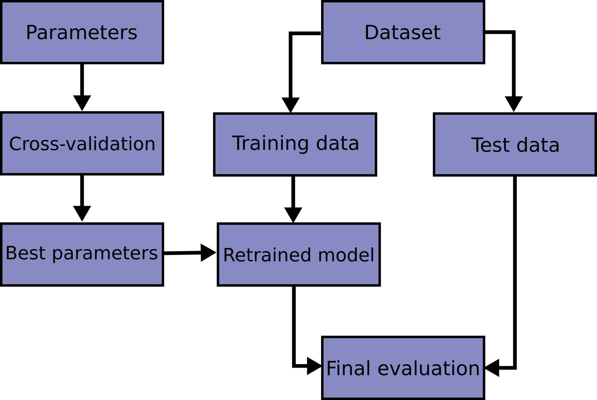

```{r setup, echo=F, purl=F}
knitr::opts_knit$set(root.dir = getwd())
knitr::opts_chunk$set(echo = TRUE, results = 'hide')
knitr::opts_chunk$set(warning = FALSE, message=FALSE)
knitr::opts_chunk$set(fig.align="center"
                      ## ,out.width="0.9\\textwidth" # latex
                      ,out.width="80%" # for both latex and html
                      ,fig.width=5, fig.height=3
                      )
```

```{r prepare, echo=F, purl=F}
rm(list=ls())
options(digits=4)
options(scipen=100)
graphics.off()
Sys.setlocale("LC_ALL", "Chinese")
library(reticulate)
```


# 简介

### 什么是scikit-learn

1.  Scikit-learn（之前作scikits.learn，也叫sklearn）是python编程语言的一个免
    费软件机器学习库。
2.  它具有各种分类，回归和聚类算法，包括支持向量机器，随机林，梯度增强，k-均值和
    DBSCAN，
3.  同时它设计成可与python数值和科学库numpy和scipy进行交互操作。


### 基本情况

1.  初始版本：2007年6月；
2.  网址：<https://scikit-learn.org/stable/>
3.  历史：

```{=html}
<!-- -->
```
1.  该项目始于2007年由David Cournapeau创立的谷歌代码之夏项目。
2.  那年晚些时候，作为论文的一部分，Matthieu Brucher开始了这个项目的工作。
3.  第一个公开发行版本，是在2010年2月1日。
4.  从那之后，有几个版本以每三个月的周期发布。

### 新算法的包含准则

1.  仅考虑包含成熟算法。
2.  一个经验准则是，自发布的至少三年后，有200多次的引用，广泛的使用和实用。
3.  对广泛使用的方法提供明确改进的技术（如，一种经强化的数据结构或更有效率的近似
    技术）也将被纳入考虑范围。
4.  在满足上述标准的算法或技术中，只有那些能极佳匹配scikit-learn当前API的才能被
    接受，即拟合，预测或转换接口以及通常具有numpy数组或稀疏矩阵的输入或输出。

### 相关项目

1.  <https://scikit-learn.org/stable/related_projects.html>

# 基本概念

## 机器学习

### 概念

1.  机器学习解决的问题涵盖从建立连接不同观测值的预测函数，到对观测值进行分类，或
    学习未标记数据集中的结构。
2.  通常，学习问题会考虑一组n个样本的数据，然后尝试预测未知数据的属性。
3.  如果每个样本都不止一个数字，例如，一个多维数据项（也称多元数据），那么它就被
    称为具有多个 `属性` 或 `特征`。

```{=html}
<!-- -->
```
1.  统计学习

    -   以统计推断为目标的机器学习的使用：根据现有的数据得出结论。

### 分类

1.  有监督学习

    -   数据具有我们想要预测的附加属性。

2.  无监督学习

    1.  其中训练数据由一组没有任何相应目标值的输入向量x组成。
    2.  这类问题的目标可能是发现数据中多组相似的例子，也就是所谓的聚类，
    3.  或者确定数据在输入空间中的分布，称为密度估计，
    4.  又或者将数据从从高维空间投影到二维或三维以可视化。

### 有监督学习 {#supervised-learning-1}

1.  分类

    1.  样本属于两个或两个以上的类，我们想从已标记的数据中学习如何预测未标记数据
        的类。
    2.  另一种将分类视为一种离散的（与连续的相反）有监督学习的形式，在这种形式下，
        仅拥有有限数量的类别，并且对提供的n个样本中的每一个，都要尝试用正确的类
        别或类来标记它们。

2.  回归

    1.  如果期望的输出由一个或多个连续变量组成，那么这个工作就成为回归。

### 训练集和测试集

1.  机器学习是学习一个数据集的一些属性，然后根据另一个数据及来测试这些数据集。
2.  在试验任何学习算法时，不要在用于拟合估计器的数据上测试一个估计器的预测值这一
    点是很重要的，因为这将无法评估估计器在新数据上的表现。这也是为什么数据集常被
    分成训练数据和测试数据。
3.  机器学习中的一个常见操作是通过将一个数据集分成两个来评估一个算法。
4.  我们称其中一个集合为训练集，我们在训练集上学习一些属性；
5.  我们称另一个集合为测试集，在这个集合中我们测试学习到的属性。

## 数据集

### 包含的数据集

1.  scikit-learn附带了一些标准数据集，例如用于分类的鸢尾和数字数据集以及用于回
    归的波士顿房价数据集。
2.  数据集是一个类似字典的对象，它保存所有数据和有关数据的一些元数据。
3.  此数据存储在 `.data` 子类中，即一个 `n_samples` ，`n_features` 数组。

### 包含的数据集

1.  我们说这些数组的第一个轴是 **样本** 轴，第二个轴是 **特征** 轴。
2.  在有监督问题的情况下，一个或多个响应变量被存储在 `.target` 子类中。
3.  数据通常是二维数组，形状（n~samples~, n~features~），尽管原始数组可能有不同的形状。
4.  当数据起初并非（n~samples~, n~features~）的形状时，需要对其进行预处理以供
    scikit-learn使用。

### 例子

1.  

    ``` {.python}
    from sklearn import datasets
    iris = datasets.load_iris()
    digits = datasets.load_digits()
    print(digits.data)
    digits.target
    digits.images[0]

    #Display the first digit
    import matplotlib.pyplot as plt
    plt.figure(1, figsize=(3, 3))
    plt.imshow(digits.images[-1], cmap=plt.cm.gray_r, interpolation='nearest')
    plt.show()

    digits.images.shape
    data = digits.images.reshape((digits.images.shape[0], -1))
    ```

## 估计器和参数

### 估计器

1.  scikit-learn执行的主要API是估计器的API。
2.  估计器：负责模型估计和解码的对象。
3.  估计器是从数据中学习的任何对象；它可以是分类，回归或聚类算法，也可以是从原始
    数据中提取/过滤有用特征的转换器。
4.  所有估计器对象都拥有一个使用数据集（通常是二维数组）的 `fit` 方法。
5.  我们可以把估计器视为一个黑箱。

```{=html}
<!-- -->
```
1.  

    ``` {.python}
    estimator.fit(data)
    ```

### 参数

1.  估计器参数：

    -   一个估计器的所有参数都可以在实例化或修改相应属性时设置：

    ``` {.python}
    estimator = Estimator(param1=1, param2=2)
    estimator.param1
    ```

2.  待估参数：

    -   当数据用估计器拟合时，参数将根据现有的数据估计。所有待估参数都是估计器对
        象的属性，以下划线结尾：

    ``` {.python}
    estimator.estimated_param_ 
    ```

### 有监督学习解决的问题

1.  有监督学习由学习两个数据及之间的联系构成：
    1.  我们试图预测的观测数据X和外部变量y，通常称为“目标”或“标签”。
    2.  通常，y是一个长度为n~样本~的一维数组。
2.  scikit-learn中的所有有监督估计器都执行一个 `fit(X, y)` 方法来拟合模型，以及
    一个 `predict(X)` 方法，在给定未标记的观测值X的情况下，返回预测标签y。
3.  如果预测任务是在一组有限的标签中对观测值进行分类，换言之就是“命名”预测到的对
    象，则该任务就称为 **分类** 任务。在scikit-learn中进行分类时，y是整数或字符
    串的向量。
4.  如果目的是预测一个连续的目标变量，那么就称为 **regression** 任务。

### 支持向量机例子

1.  

    ``` {.python}
    from sklearn import datasets
    digits = datasets.load_digits()

    from sklearn import svm
    clf = svm.SVC(gamma=0.001, C=100.)

    clf.fit(digits.data[:-1], digits.target[:-1])
    clf.predict(digits.data[-1:])
    ```

## 模型选择

### 选择正确的估计器

1.  通常，解决机器学习问题最困难的部分是为工作找到正确的估计器。
2.  不同的估计器适合不同类型的数据和不同的问题。
3.  <https://scikit-learn.org/stable/tutorial/machine_learning_map/index.html>

### 分类图


### Score

1.  每个估计器都有一个 `score` 方法，可以评判新数据的拟合（或预测）质量。
2.  为了更好地衡量预测精度（我们可以用它来代表模型的拟合优度），我们可以将用于训
    练和测试的数据连续地分成几部分。
3.  Scikit-learn有一个类集合，可用于为流行的交叉验证策略生成训练/测试索引列表。
4.  他们拥有一个 `split` 方法，该方法接受要拆分的输入数据集，并为所选交叉验证策
    略的每次迭代生成训练/测试索引。

### Cross-validated scores

1.  交叉验证分数可以使用 `cross_val_score` 助手直接计算。
2.  给定一个估计器，交叉验证对象和输入数据集，`cross_val_score` 将数据重复分解为
    训练集和数据集，使用训练集训练估计器，并根据每次交叉验证迭代的训练集计算得分。
3.  默认使用估计器的score方法计算个体得分。

### Grid-search

1.  scikit-learn提供了一个对象，在给定数据的情况下，计算估计器在参数网格上拟合时
    的得分，并选择参数以使交叉验证的分最大化。
2.  默认情况下，GridSearchCV使用三重交叉验证。然而，如果它检测到一个分类量被传
    递，而不是一个回归量，那就将使用一个分层的三重交叉验证。在版本0.22中，默认情
    况将变为使用五重交叉验证。

# 应用流程

## 拟合与预测：估计器基础

### 拟合

1.  Scikit-learn提供了几十种内置的机器学习算法和模型，称为估计器。
2.  每个估计器都可以使用它的 `fit` 方法来拟合某些数据。

```{=html}
<!-- -->
```
1.  例子：将 `RandomForestClassifier` 与数据匹配

    ``` {.python}
    from sklearn.ensemble import RandomForestClassifier
    clf = RandomForestClassifier(random_state=0)
    X = [[ 1,  2,  3],  # 2 samples, 3 features
         [11, 12, 13]]
    y = [0, 1]  # classes of each sample
    clf.fit(X, y)
    ```

### 拟合

1.  `fit` 方法通常接受两个输入。
2.  样本矩阵（或设计矩阵）X。X的大小通常为(n~samples~, n~features~)，即样本表示为行，特
    征表示为列。
3.  目标值y是回归任务的实数，或用于分类的整数（或其他任何离散值得的集）。对于无监
    督学习任务，无需明确y。
4.  y通常是一维数组，其中第i项对应于X的第i个样本（行）的目标。
5.  尽管有些估计器使用例如稀疏矩阵的其他格式，X和y则通常认为是numpy数组或等效的类
    似数组的数据类型。

## 转换器和预处理器

### 转换器和预处理器

1.  机器学习工作流通常由不同的部分组成。
2.  一条典型的管线包括一个转换或插补数据的预处理步骤和一个预测目标值的最终预测量。
3.  在scikit-learn中，预处理器和转换器都遵循与估计器对象相同的API（实际上它们都继
    承自相同的 `BaseEstimator` 类）。
4.  转换器对象没有 `predict` 方法，而有一个输出新转换的样本矩阵X的 `transform` 
    方法。
5.  针对不同特征应用不同转换：`ColumnTransformer` 正是为这些用例设计的。

### 例子

``` {.python}
from sklearn.preprocessing import StandardScaler
X = [[0, 15],
     [1, -10]]
StandardScaler().fit(X).transform(X)
```

## 管线：链接预处理器和估计器

### 管线

1.  转换器和估计器（预测量）可以组合成一个统一的对象: 一个 `Pipeline`。
2.  该管线提供了与常规估计器相同的API：它可以通过fit和predict进行拟合并用于预测。
3.  我们将在后面看到，使用管线还可以防止数据泄漏，即在训练数据中泄露一些测试数据。

### 例子

``` {.python}
from sklearn.preprocessing import StandardScaler
from sklearn.linear_model import LogisticRegression
from sklearn.pipeline import make_pipeline
from sklearn.datasets import load_iris
from sklearn.model_selection import train_test_split
from sklearn.metrics import accuracy_score

# create a pipeline object
pipe = make_pipeline(StandardScaler(), LogisticRegression(random_state=0))

# load the iris dataset and split it into train and test sets
X, y = load_iris(return_X_y=True)
X_train, X_test, y_train, y_test = train_test_split(X, y, random_state=0)

# fit the whole pipeline
pipe.fit(X_train, y_train)
# we can now use it like any other estimator
accuracy_score(pipe.predict(X_test), y_test)
```

## 模型评估

### 模型评估

1.  将一个模型与某些数据相拟合并不意味着它能很好地预测未知数据。
2.  这需要直接评估。
3.  我们刚刚看到了将数据集拆分为训练集和测试集的 `train_test_split` 助手，但是
    scikit-learn还提供了许多其他的模型评估工具，特别是交叉验证工具。

### 例子

-   这里我们简要介绍如何使用 `cross_validate` 助手执行5重交叉验证程序。请注意，
    还可以手动迭代折叠，使用不同的数据分割策略，并使用自定义的评分函数。

``` {.python}
from sklearn.datasets import make_regression
from sklearn.linear_model import LinearRegression
from sklearn.model_selection import cross_validate

X, y = make_regression(n_samples=1000, random_state=0)
lr = LinearRegression()

result = cross_validate(lr, X, y)  # defaults to 5-fold CV
result['test_score']  # r_squared score is high because dataset is easy
```

## 自动参数搜索

### 参数搜索

1.  所有的估计器都有可以调整的参数（文献中常称为超参数）。
2.  估计器的泛化能力通常取决于几个参数。
3.  例如，`RandomForestRegressor` 有一个 n~estimators~ 参数，用于确定林中树
    的数目，以及一个 max~depth~参数，用于确定每棵树的最大深度。
4.  通常，这些参数的确切值应该是多少是不明确的，因为它们取决于现有的数据。 
5.  Scikit-learn提供了自动找到最佳参数组合的工具（通过交叉验证）。

### 例子

1.  在下面的例子中，我们使用`RandomizedSearchCV` 对象随机搜索随机林的参数空间。
2.  当搜索完成时，`RandomizedSearchCV` 表现得像已经拟合了最佳参数集的
    `RandomForestRegressor`。

### 例子: 代码

``` {.python}
from sklearn.datasets import fetch_california_housing
from sklearn.ensemble import RandomForestRegressor
from sklearn.model_selection import RandomizedSearchCV
from sklearn.model_selection import train_test_split
from scipy.stats import randint
X, y = fetch_california_housing(return_X_y=True)
X_train, X_test, y_train, y_test = train_test_split(X, y, random_state=0)
# define the parameter space that will be searched over
param_distributions = {'n_estimators': randint(1, 5),
           'max_depth': randint(5, 10)}
# now create a searchCV object and fit it to the data
search = RandomizedSearchCV(estimator=RandomForestRegressor(random_state=0), n_iter=5,
                            param_distributions=param_distributions, random_state=0)
search.fit(X_train, y_train)
search.best_params_
# the search object now acts like a normal random forest estimator
# with max_depth=9 and n_estimators=4
search.score(X_test, y_test)
```

# 有监督学习

## 种类

### scikit-learn 有监督学习算法

1.  线性模型
2.  线性和二次判别分析
3.  核岭回归
4.  支持向量机
5.  随机梯度下降
6.  最近的邻居
7.  高斯过程
8.  交叉分解
9.  朴素贝叶斯

### scikit-learn 有监督学习算法

1.  决策树
2.  集成方法
3.  多类和多标签算法
4.  特征选择
5.  半监督
6.  保序回归
7.  概率校准
8.  神经网络模型（有监督）

## 例子：线型回归

### sklearn.linear_model.LinearRegression

1.  LinearRegression拟合一个带系数w = (w1, ..., wp)的线性模型，用来最小化数据集
    中观测目标与线性近似预测目标之间的残差平方和。

2.  从实现的角度来看，这只是普通最小二乘(`scipy.linalg.lstsq`)包装为一个预测器对
    象。

### 方法

  ------------------------------ -----------------------------------------------------------------
  `fit(self, X, y)`              拟合线性模型
  `get_params(self[, deep])`     获取这个估计器的参数
  `predict(self, X)`             用线性模型进行预测
  `score(self, X, y)`            返回预测的判定系数R^2
  `set_params(self, **params)`   设置这个估计器的参数
  ------------------------------ -----------------------------------------------------------------

### 例子1

``` {.python}
import numpy as np
from sklearn.linear_model import LinearRegression
X = np.array([[1, 1], [1, 2], [2, 2], [2, 3]])
# y = 1 * x_0 + 2 * x_1 + 3
y = np.dot(X, np.array([1, 2])) + 3
reg = LinearRegression().fit(X, y)

reg.score(X, y)
reg.coef_
reg.intercept_
reg.predict(np.array([[3, 5]]))
```

### 例子2

``` {.python}
import matplotlib.pyplot as plt
import numpy as np
from sklearn import datasets, linear_model
from sklearn.metrics import mean_squared_error, r2_score

# Load the diabetes dataset
diabetes_X, diabetes_y = datasets.load_diabetes(return_X_y=True)
# Use only one feature
diabetes_X = diabetes_X[:, np.newaxis, 2]
# Split the data into training/testing sets
diabetes_X_train = diabetes_X[:-20]
diabetes_X_test = diabetes_X[-20:]

# Split the targets into training/testing sets
diabetes_y_train = diabetes_y[:-20]
diabetes_y_test = diabetes_y[-20:]

```

### 例子2

``` {.python}
# Create linear regression object
regr = linear_model.LinearRegression()
# Train the model using the training sets
regr.fit(diabetes_X_train, diabetes_y_train)
# Make predictions using the testing set
diabetes_y_pred = regr.predict(diabetes_X_test)
# The coefficients
print('Coefficients: \n', regr.coef_)
# The mean squared error
print('Mean squared error: %.2f'
      % mean_squared_error(diabetes_y_test, diabetes_y_pred))
# The coefficient of determination: 1 is perfect prediction
print('Coefficient of determination: %.2f'
      % r2_score(diabetes_y_test, diabetes_y_pred))
# Plot outputs
plt.scatter(diabetes_X_test, diabetes_y_test,  color='black')
plt.plot(diabetes_X_test, diabetes_y_pred, color='blue', linewidth=3)
plt.xticks(());plt.yticks(())
plt.show()
```

# 无监督学习

## 种类

### scikit-learn 中无监督学习算法

1.  Gaussian mixture models高斯混合模型
2.  Manifold learning流形学习
3.  Clustering聚类
4.  Biclustering双向聚类
5.  Decomposing signals in components (matrix factorization problems)信号的分量分解（矩阵分解问题）
6.  Covariance estimation协方差估计
7.  Novelty and Outlier Detection新奇性和异常值检测
8.  Density Estimation密度估计
9.  Neural network models (unsupervised)神经网络模型（无监督）

## 例子：K 均值聚类

### sklearn.cluster.KMeans

1.  `KMeans`算法通过试着将样本分离到n组方差相等的情况下对数据进行聚类，从而最小
    化被称为惯性或聚类内平方和的标准。
2.  该算法要求指定集群的数量。
3.  它可以很好地扩展到大量的样本，并且已经在许多不同领域的应用中广泛使用。

### 方法

  -------------------------------- --------------------------------------------------------------------
  fit(self, X[, y])              计算k-means聚类
  fit_predict(self, X[, y])      计算每个样本的聚类中心并预测聚类索引
  fit_transform(self, X[, y])    计算聚类并将X转换为聚类距离空间
  get_params(self[, deep])       获取这个估计器的参数。
  predict(self, X)                 预测X中每个样本所属于的最近的聚类
  score(self, X[, y])            k均值目标上的X的相反值
  set_params(self, **params)     设置估计器的参数
  transform(self, X)               将X转换为聚类距离空间
  -------------------------------- --------------------------------------------------------------------

### 例子1

``` {.python}
from sklearn.cluster import KMeans
import numpy as np
X = np.array([[1, 2], [1, 4], [1, 0],
              [10, 2], [10, 4], [10, 0]])
kmeans = KMeans(n_clusters=2, random_state=0).fit(X)
kmeans.labels_

kmeans.predict([[0, 0], [12, 3]])

kmeans.cluster_centers_

```

### 例子2

``` {.python}
import numpy as np
import matplotlib.pyplot as plt
# Though the following import is not directly being used, it is required
# for 3D projection to work
from mpl_toolkits.mplot3d import Axes3D

from sklearn.cluster import KMeans
from sklearn import datasets

np.random.seed(5)

iris = datasets.load_iris()
X = iris.data
y = iris.target

estimators = [('k_means_iris_8', KMeans(n_clusters=8)),
              ('k_means_iris_3', KMeans(n_clusters=3)),
              ('k_means_iris_bad_init', KMeans(n_clusters=3,
                                               n_init=1, init='random'))]
```

### 例子2

``` {.python}
fignum = 1
titles = ['8 clusters', '3 clusters', '3 clusters, bad initialization']
for name, est in estimators:
    fig = plt.figure(fignum, figsize=(4, 3))
    ax = Axes3D(fig, rect=[0, 0, .95, 1], elev=48, azim=134)
    est.fit(X)
    labels = est.labels_

    ax.scatter(X[:, 3], X[:, 0], X[:, 2],
               c=labels.astype(np.float), edgecolor='k')

    ax.w_xaxis.set_ticklabels([])
    ax.w_yaxis.set_ticklabels([])
    ax.w_zaxis.set_ticklabels([])
    ax.set_xlabel('Petal width')
    ax.set_ylabel('Sepal length')
    ax.set_zlabel('Petal length')
    ax.set_title(titles[fignum - 1])
    ax.dist = 12
    fignum = fignum + 1
```

### 例子2

``` {.python}
# Plot the ground truth
fig = plt.figure(fignum, figsize=(4, 3))
ax = Axes3D(fig, rect=[0, 0, .95, 1], elev=48, azim=134)
for name, label in [('Setosa', 0),
                    ('Versicolour', 1),
                    ('Virginica', 2)]:
    ax.text3D(X[y == label, 3].mean(),
              X[y == label, 0].mean(),
              X[y == label, 2].mean() + 2, name,
              horizontalalignment='center',
              bbox=dict(alpha=.2, edgecolor='w', facecolor='w'))
# Reorder the labels to have colors matching the cluster results
y = np.choose(y, [1, 2, 0]).astype(np.float)
ax.scatter(X[:, 3], X[:, 0], X[:, 2], c=y, edgecolor='k')

ax.w_xaxis.set_ticklabels([]);ax.w_yaxis.set_ticklabels([])
ax.w_zaxis.set_ticklabels([])
ax.set_xlabel('Petal width');ax.set_ylabel('Sepal length')
ax.set_zlabel('Petal length');ax.set_title('Ground Truth')
ax.dist = 12
fig.show()
```

# 模型选择和评价

## 训练集，验证集和测试集

### 背景

1. 学习一个预测函数的参数并在同一数据上测试它是一种方法上的错误:
2. 如果一个模型只是重复它刚刚看到的样本的标签，那么它会得到一个完美的分数，但它
   无法对未见数据做出任何有用的预测。
3. 这种情况称为**过拟合**。为了避免这种情况，在执行一个(监督的)机器学习实验时，
    通常的做法是将一部分可用数据作为测试集`X_test, y_test`。
4. 在scikit-learn中，可以通过`train_test_split`辅助函数快速地将训练集和测试集随
    机分割。

### 机器学习流程图



### 为什么需要验证集

1.  在评估评估器的不同设置(“超参数”)时，比如必须为支持向量机手动设置的C设置，由
    于可以调整参数，直到评估器执行最优，所以仍然存在测试集过拟合的风险。
2.  这样，关于测试集的知识就会“泄露”到模型中，并且评估度量不再报告泛化性能。
3.  为了解决这个问题，数据集的另一部分可以作为所谓的“**验证集**”

### 训练集，验证集和测试集定义

1.  训练集：

    -   用于拟合模型的数据样本。

2.  验证集：

    -   在调优模型超参数时，该数据样本用于对模型是否适合训练数据集提供无偏评估。
        随着验证数据集上的技能被合并到模型配置中，评估变得更加有偏。

3.  测试集：

    -   这个数据样本用来提供一个适合训练数据集的无偏评估的最终模型。

### 训练集

1.  用训练集来拟合模型，用训练集来寻找“最优”的权重。用于拟合模型的参数(如人工神
    经网络中神经元之间的连接权值)。
2.  使用监督学习方法(如梯度下降或随机梯度下降)在训练数据集上对模型(例如神经网络
    或朴素贝叶斯分类器)进行训练。
3.  当前的模型与训练数据集一起运行，并产生一个结果，然后与训练数据集中的每个输入
    向量的目标进行比较。
4.  根据比较结果和所使用的具体学习算法，对模型的参数进行调整。
5.  模型拟合可以包括变量选择和参数估计。

### 验证集

1.  当调整模型的超参数时，验证数据集提供了一个适合训练数据集的无偏倚的评估模型。
    （比如神经网络中隐藏单元的数量)。
2.  验证集用于估计模型选择的预测误差；
3.  验证数据集可以通过早期停止用于正则化：当验证数据集上的错误增加时停止训练，因
    为这是训练数据集过拟合的标志。
4.  验证数据集的功能是混合的：它是用于测试的训练数据，但既不作为低级训练的一部
    分，也不作为最终测试的一部分。
5.  验证数据集还可以在其他形式的模型准备中发挥作用，如特征选择。

### 测试集

1.  用于提供一个最终模型的适合训练数据集的无偏评估。如果测试数据集中的数据从来没
    有在训练中使用过(例如在交叉验证中)，那么测试数据集中也被称为保持数据集。
2.  测试集用于评估最终选择的模型的泛化误差。
3.  理想情况下，测试集应该保存在一个“储藏室”中，并且只有在数据分析结束时才取出
    来。
4.  根据NN[神经网络]文献的标准定义，测试集从不用于在两个或多个网络中进行选择，因
    此测试集上的误差提供了泛化误差的无偏估计。

### 说明

1.  最后的模型可以在训练数据集和验证数据集的基础上进行拟合。
2.  在调优超参数和数据准备时，“验证数据集”主要用于描述模型的评估，而“测试数据集”
    主要用于描述最终调优模型与其他最终模型的评估。
3.  “验证数据集”和“测试数据集”的概念在采用类似k-fold交叉验证的交替重采样方法时可
    能会消失。
4.  参考：
    -   <https://en.wikipedia.org/wiki/Training,_validation,_and_test_sets>
    -   <https://machinelearningmastery.com/difference-test-validation-datasets/>

### 伪代码

``` {.python}
# split data
data = ...
train, validation, test = split(data)

# tune model hyperparameters
parameters = ...
for params in parameters:
   model = fit(train, params)
   skill = evaluate(model, validation)

# evaluate final model for comparison with other models
model = fit(train)
skill = evaluate(model, test)
```

### 例子

``` {.python}
### 注意：该例子没有验证集
import numpy as np
from sklearn.model_selection import train_test_split
from sklearn import datasets
from sklearn import svm

X, y = datasets.load_iris(return_X_y=True)
X.shape, y.shape

X_train, X_test, y_train, y_test = train_test_split(
    X, y, test_size=0.4, random_state=0)

X_train.shape, y_train.shape

X_test.shape, y_test.shape

clf = svm.SVC(kernel='linear', C=1).fit(X_train, y_train)
clf.score(X_test, y_test)
```

## 交叉验证

### 为什么需要交叉验证

1.  把可用的数据分成三组，大大减少了用于学习模型的样本数量，
2.  并且结果可以依赖于对(训练，验证)集的特定随机选择。
3.  验证集是对模型的单一评价，并具有有限的能力来表征结果中的不确定性。

### 交叉验证(cross validation)

1.  这个问题的解决方案是一个称为交叉验证(简称CV)的过程。测试集仍然需要用于最终评
    估，但在做CV时不再需要验证集。
2.  现代应用机器学习中，你很可能看不到关于训练、验证和测试数据集的参考。
3.  如果从业者选择使用k-fold与训练数据集交叉验证来调优模型超参数，那么对“验证数
    据集”的参考就会消失。
4.  如果使用训练数据集对模型超参数的交叉验证嵌套在更广泛的模型交叉验证中，那么对
    “测试数据集”的参考也可能消失。
5.  交叉验证迭代器可以直接通过网格搜索模型的最优超参数来进行模型选择。

### k-fold 交叉验证

1.  训练集被分成k个更小的集。
2.  每一次k次“折叠”的步骤如下:
    1.  使用$k-1$ 个folds作为训练数据来训练一个模型;
    2.  生成的模型在数据的其余部分上进行验证(例如，它被用作一个测试集来计算一个
        性能度量，比如精度)。
3.  k-fold交叉验证报告的性能度量是循环中计算的值的平均值。
4.  这种方法的计算代价可能很高，但不会浪费太多数据(就像修复任意验证集一样)，这在
    样本数量非常少的问题中是一个主要优势。

### k-fold 交叉验证示意图


### 交叉验证伪代码

``` {.python}
# split data
data = ...
train, test = split(data)

# tune model hyperparameters
parameters = ...
k = ...
for params in parameters:
   skills = list()
   for i in k:
      fold_train, fold_val = cv_split(i, k, train)
      model = fit(fold_train, params)
      skill_estimate = evaluate(model, fold_val)
      skills.append(skill_estimate)
   skill = summarize(skills)

# evaluate final model for comparison with other models
model = fit(train)
skill = evaluate(model, test)
```

### 计算交叉验证指标

1. 使用交叉验证的最简单方法是在估计器和数据集上调用**cross_val_score** helper函
    数。
2. 下面的例子演示了如何通过分割数据、拟合模型和连续5次计算分数来估计iris数据集
    上的线性核支持向量机的精度。
3. 当“cv”参数是整数时，**cross_val_score**默认使用KFold策略。
4. 默认情况下，每次CV迭代计算的分数是估计器的分数方法。可以通过使用“score”参数
    来改变这一点。

### 例子

``` {.python}
from sklearn.model_selection import cross_val_score
clf = svm.SVC(kernel='linear', C=1)
scores = cross_val_score(clf, X, y, cv=5)
scores

from sklearn import metrics
scores = cross_val_score(
    clf, X, y, cv=5, scoring='f1_macro')
scores
```

## 交叉验证循环方式

### 不同数据类型交叉验证

1.  用于独立同分布数据的交叉验证迭代器。
2.  基于类标签分层的交叉验证迭代器。
3.  用于分组数据的交叉验证迭代器。
4.  用于时间序列数据的交叉验证迭代器。

### 5种交叉验证方式

1.  K-fold: `sklearn.model_selection.KFold`
2.  Repeated K-Fold: `sklearn.model_selection.RepeatedKFold`
3.  Leave One Out (LOO): `sklearn.model_selection.LeaveOneOut`
4.  Leave P Out (LPO): `sklearn.model_selectionLeavePOut.`
5.  Random permutations cross-validation a.k.a. Shuffle & Split:
    `sklearn.model_selection.ShuffleSplit`

### 例子

``` {.python}
import numpy as np

## K-fold
from sklearn.model_selection import KFold

X = ["a", "b", "c", "d"]
kf = KFold(n_splits=2)
for train, test in kf.split(X):
    print("%s %s" % (train, test))

# Repeated K-Fold
from sklearn.model_selection import RepeatedKFold
X = np.array([[1, 2], [3, 4], [1, 2], [3, 4]])
random_state = 12883823
rkf = RepeatedKFold(n_splits=2, n_repeats=2, random_state=random_state)
for train, test in rkf.split(X):
    print("%s %s" % (train, test))
```

### 例子

``` {.python}
from sklearn.model_selection import LeaveOneOut
X = [1, 2, 3, 4]
loo = LeaveOneOut()
for train, test in loo.split(X):
    print("%s %s" % (train, test))

from sklearn.model_selection import LeavePOut
X = np.ones(4)
lpo = LeavePOut(p=2)
for train, test in lpo.split(X):
    print("%s %s" % (train, test))

from sklearn.model_selection import ShuffleSplit
X = np.arange(10)
ss = ShuffleSplit(n_splits=5, test_size=0.25, random_state=0)
for train_index, test_index in ss.split(X):
    print("%s %s" % (train_index, test_index))
```

## 调整估计器的超参数

### 超参数

1.  超参数是不能直接从估计器中获得的参数。在scikit-learn中，它们作为参数传递给估
    计器类的构造函数。
2.  典型的例子包括对于支持向量分类器的 `C`， `kernel` 和 `gamma` , `alpha` 套索，等等。
3.  这是可能的，建议搜索超参数空间，以获得最佳交叉验证评分。
4.  在构造估计器时提供的任何参数都可以用这种方式进行优化。具体来说，要查找给定估
    计器的所有参数的名称和当前值，请使用:

``` {.python}
estimator.get_params()
```

### 如何搜索

1.  搜索包括：
    1.  估计器(回归或分类器，如`sklearn.svm.SVC()`)；
    2.  一个参数空间；
    3.  一种搜索或抽样候选者的方法；
    4.  一个交叉验证方案；
    5.  一个得分函数。

### 两种通用的方法

1.  scikit-learn中提供了抽样搜索候选的两种通用方法：
    1.  对于给定的值，`GridSearchCV`会全面考虑所有参数组合，
    2.  而`RandomizedSearchCV`可以从指定分布的参数空间中抽取给定数量的候选。
2.  请注意，这些参数的一个小子集通常会对模型的预测或计算性能产生很大影响，而其他
    参数可以保留其默认值。
3.  建议阅读estimator类的文档字符串，以更好地理解它们的预期行为。

### 详尽的网格搜索

1.  由`GridSearchCV`提供的网格搜索会从**param_grid**参数指定的参数值网格中全面生
    成候选参数。
2.  `GridSearchCV`实例实现了通常的estimator API:当将其“拟合”到数据集上时，将评估
    所有可能的参数值组合，并保留最佳组合。

``` {.python}
param_grid = [
  {'C': [1, 10, 100, 1000], 'kernel': ['linear']},
  {'C': [1, 10, 100, 1000], 'gamma': [0.001, 0.0001], 'kernel': ['rbf']},
 ]
```

### 随机参数优化

1.  虽然使用参数设置网格是目前使用最广泛的参数优化方法，但其他搜索方法具有更有利
    的性能。
2.  `RandomizedSearchCV`实现了对参数的随机搜索，其中每个设置都从可能的参数值的分
    布中采样。
3.  相对于穷尽搜索，有两个主要的好处:
    1. 预算的选择可以独立于参数的数量和可能的值。
    2. 添加不影响性能的参数不会降低效率。

### 随机参数优化

1.  指定如何采样参数是使用字典来完成的，这与为`GridSearchCV`指定参数非常相似。
2.  另外，使用**n_iter**参数指定计算预算，即抽样候选数或抽样迭代数。
3.  对于每个参数，可以指定可能值的分布或一系列离散选择(将统一采样)。

``` {.python}
{'C': scipy.stats.expon(scale=100), 'gamma': scipy.stats.expon(scale=.1),
  'kernel': ['rbf'], 'class_weight':['balanced', None]}
```

### 随机参数优化

1.  原则上，可以传递提供rvs（随机变量样本）方法以采样值的任何函数。 调用rvs函数
    应从连续调用的可能参数值中提供独立的随机样本。
2.  对于连续参数，例如上面的`C`，指定连续分布以充分利用随机性很重要。 这样，增加
    **n_iter**总是会导致更精细的搜索。

### 指定客观指标

1.  默认情况下，参数搜索使用估算器的 `score` 功能来评估参数设置。
2.  这是用来分类的**sklearn.metrics.accuracy_score**和用来回归的
    **sklearn.metrics.r2_score**。
3.  对于某些应用程序，其他计分功能更适合（例如，在不平衡分类中，准确性得分通常不
    具信息性）。
4.  可以通过`GridSearchCV`, `RandomizedSearchCV`和下面描述的许多专用交叉验证工具
    的scoring参数指定替代的`scoring`函数。

## 指标和评分：量化预测的质量

### 3种不同的API

1.  有3种不同的API可用于评估模型预测的质量：
2.  `Dummy` 估算量对于获取这些指标的基线值以进行随机预测很有用。

```{=html}
<!-- -->
```
1.  估算量评分方法：

    -   估算量有一种计分方法，可为设计要解决的问题提供默认的评估标准。
    -   本页中没有讨论此问题，但是每个估算量的文档中都对此进行了讨论。

### 3种不同的API

1.  评分参数：

    -   使用交叉验证的模型评估工具（例如`model_selection.cross_val_score` 和
        `model_selection.GridSearchCV`) 依靠内部评分战略。

2.  指标功能：

    -   `metrics` 模块实现了针对特定目的评估预测误差的功能。
    -   这些度量在“分类”度量，“多标签排名”度量，“回归”度量和“聚类”度量的各节中详
        细介绍。

### 评分参数

1.  使用诸如`model_selection.GridSearchCV`和`model_selection.cross_val_score`之
    类的工具进行模型选择和评估，会采用`scoring`参数，该参数控制它们对所评估的估
    算器应用何种度量。
2.  对于最常见的用例，您可以使用`scoring`参数指定一个计分器对象。
3.  所有计分器对象均遵循以下约定：较高的返回值比较低的返回值更好。
4.  因此，用于度量模型与数据之间距离的度量（如**metrics.mean_squarederror**）可
    以作为**neg_meansquarederror**（其返回度量值的取反值）使用。

### 分类指标

1.  其中一些仅限于二进制分类的情况：
    1.  precision_recallcurve(y_true, probas_pred): 计算不同概率阈值的精确召
        回对
    2.  roc_curve(y_true, y_score\[, pos_label, ...\]): 计算接收器工作特性
        （ROC）
2.  其他人也可以在多类情况下工作：
    1.  balanced_accuracyscore(y_true, y_pred\[, ...\]): 计算平衡精度
    2.  cohen_kappascore(y1, y2\[, labels, weights, ...\]): Cohen's kappa: 度量
        注释者间协议的统计数据。
    3.  confusion_matrix(y_true, y_pred\[, labels, ...\]): 计算混淆矩阵以评估
        分类的准确性。
    4.  hinge_loss(y_true, pred_decision\[, labels, ...\]): 平均铰链损耗（非
        常规）
    5.  matthews_corrcoef(y_true, y_pred\[, ...\]): 计算马修斯相关系数（MCC）
    6.  roc_aucscore(y_true, y_score\[, average, ...\]): 根据预测分数计算接收
        器工作特性曲线（ROC AUC）下的面积。

### 分类指标

1.  有些在多标签的情况下也可以使用：
    1.  accuracy_score(y_true, y_pred\[, normalize, ...\]): Accuracy
        classification score.
    2.  classification_report(y_true, y_pred\[, ...\]): Build a text
        report showing the main classification metrics
    3.  f1_score(y_true, y_pred\[, labels, ...\]): Compute the F1
        score, also known as balanced F-score or F-measure
    4.  fbeta_score(y_true, y_pred, beta\[, labels, ...\]): Compute
        the F-beta score
    5.  hamming_loss(y_true, y_pred\[, labels, ...\]): Compute the
        average Hamming loss.
    6.  jaccard_score(y_true, y_pred\[, labels, ...\]): Jaccard
        similarity coefficient score
    7.  log_loss(y_true, y_pred\[, eps, normalize, ...\]): Log loss,
        aka logistic loss or cross-entropy loss.
    8.  multilabel_confusionmatrix(y_true, y_pred): Compute a
        confusion matrix for each class or sample

### Classification metrics

1.  precision_recallfscoresupport(y_true, y_pred): 计算每个班级的精度，召回率，
    F量度和支持
2.  precision_score(y_true, y_pred\[, labels, ...\]): 计算精度
3.  recall_score(y_true, y_pred\[, labels, ...\]): 计算召回率
4.  roc_aucscore(y_true, y_score\[, average, ...\]): 根据预测分数计算接收器工作
    特性曲线（ROC AUC）下的面积。
5.  zero_oneloss(y_true, y_pred\[, normalize, ...\]): 零一分类损失。
6.  还有一些解决二进制和多标签（但不是多类）问题的方法：
    average_precisionscore(y_true, y_score\[, ...\]):根据预测分数计算平均精度
    （AP）

### 多标签排名指标

1.  覆盖错误： The `coverage_error`
2.  标签排名平均精度： The`label_ranking_average_precision_score`
3.  排名损失： The `label_ranking_loss`
4.  归一化折现累积收益

### 回归指标

1.  解释方差得分： The `explained_variance_score`
2.  最大错误： The `max_error`
3.  平均绝对误差： The `mean_absolute_error`
4.  均方误差： The `mean_squared_error`
5.  均方对数误差： The `mean_squared_log_error`
6.  中位数绝对错误： The `median_absolute_error`
7.  R²得分，确定系数： The `r2_score`
8.  平均泊松，伽玛和特威迪偏差： The`mean_tweedie_deviance`

### 聚类指标

1.  调整后的兰德指数： `adjusted_rand_score`
2.  基于相互信息的分数： `adjusted_mutual_info_score`
3.  同质性，完整性和V度量： `homogeneity_score`,
    `completeness_score`, `v_measure_score`
4.  福克斯-锦葵分数： `fowlkes_mallows_score`
5.  轮廓系数： `silhouette_score`
6.  Calinski-Harabasz指数： `calinski_harabasz_score`
7.  Davies-Bouldin指数： `davies_bouldin_score`
8.  权变矩阵： `sklearn.metrics.cluster.contingency_matrix`

### 虚拟估计量

1.  在进行监督学习时，简单的健全性检查包括将自己的估计量与简单的经验法则进行比
    较。

```{=html}
<!-- -->
```
1.  `DummyClassifier` 实现几种简单的分类策略：

    1.  **stratified** 通过遵守训练集类别分布来生成随机预测。
    2.  **most_frequent** 总是预测训练集中最频繁的标签。
    3.  **prior** 总是预测训练集中最频繁的标签。
    4.  **uniform** 随机均匀地生成预测。
    5.  **constant** 总是预测用户提供的恒定标签。

### 虚拟估计量

1.  注意，使用所有这些策略，预测方法将完全忽略输入数据！
2.  更一般而言，当分类器的准确性太接近于随机性时，这可能意味着出了点问题：功能无
    济于事，超参数未正确调整，分类器遭受类不平衡等。

### 例子

``` {.python}
### create an imbalanced dataset
from sklearn.datasets import load_iris
from sklearn.model_selection import train_test_split
X, y = load_iris(return_X_y=True)
y[y != 1] = -1
X_train, X_test, y_train, y_test = train_test_split(X, y, random_state=0)

### compare the accuracy of SVC and most_frequent
from sklearn.dummy import DummyClassifier
from sklearn.svm import SVC
clf = SVC(kernel='linear', C=1).fit(X_train, y_train)
clf.score(X_test, y_test)
clf = DummyClassifier(strategy='most_frequent', random_state=0)
clf.fit(X_train, y_train)
clf.score(X_test, y_test)

### change the kernel
clf = SVC(kernel='rbf', C=1).fit(X_train, y_train)
clf.score(X_test, y_test)
```

### 虚拟估计量

1.  `DummyRegressor` 还实现了四个简单的回归经验法则：

    1.  **mean** 总是预测训练目标的平均值。
    2.  **median** 总是预测训练目标的中位数。
    3.  **quantile** 总是预测用户提供的训练目标的分位数。
    4.  **constant** 总是预测用户提供的恒定值。
    5.  在所有这些策略中，预测方法完全忽略了输入数据。

## 模型持久性

### 模型持久性

1.  训练了scikit学习模型后，希望有一种方法可以持久保留模型以备将来使用，而不必重
    新训练。
2.  通过使用Python的内置持久性模型`pickle`，可以在scikit-learn中保存模型。
3.  在scikit-learn的特定情况下，最好使用`joblib`的替代pickle（`dump` &
    `load`），这种方法在内部通常携带大型numpy数组的对象上效率更高。 适用于适合的
    scikit-learn估计器，但只能在磁盘上pickle而不能在字符串上pickle。

### 例子

``` {.python}
from sklearn import svm
from sklearn import datasets
clf = svm.SVC()
X, y= datasets.load_iris(return_X_y=True)
clf.fit(X, y)

import pickle
s = pickle.dumps(clf)
clf2 = pickle.loads(s)
clf2.predict(X[0:1])

y[0]

from joblib import dump, load
dump(clf, 'filename.joblib')
clf = load('filename.joblib') 
```

## 验证曲线：绘制分数以评估模型

### 简介

1.  每个估算量都有其优点和缺点。
2.  它的泛化误差可以根据`bias`,`variance` 和 `noise`来分解。
3.  估计量的`bias`是不同训练集的平均误差。
4.  估计量的`variance`表明它对变化的训练集有多敏感。
5.  `Noise` 是数据的属性。
6.  偏差和方差是估计量的固有属性，我们通常必须选择学习算法和超参数，以使偏差和方
    差都尽可能低（偏差方差难题）。
7.  减少模型差异的另一种方法是使用更多的训练数据。

### 简介例子

1.  在下图中，我们看到了一个函数
2.  $f(x) = \cos (\frac{3}{2} \pi x)$ 以及该功能的一
    些嘈杂样本。
3.  我们使用三种不同的估计器来拟合该函数：具有1、4和15阶多项式特征的线性回归。

`\center
[[file:images/overfitting.png]`{=latex}\]

### 简介例子

1.  我们看到，第一个估计器充其量只能提供与样本和真实函数的较差拟合，因为它太简单
    了（高偏差，**underfiting**)
2.  第二个估算器几乎完美地估计了它
3.  而最后一个估算器可以完美地近似训练数据，但不能很好地拟合真实函数，即它对变化
    的训练数据非常敏感（高方差， **overfitting**).
4.  在示例中我们看到的简单的一维问题中，很容易看到估计量是否存在偏差或方差。
5.  但是，在高维空间中，模型变得非常难以可视化。

### 验证曲线

1.  为了验证模型，我们需要一个评分函数，例如分类器的准确性。
2.  选择一个估计器的多个超参数的正确方法是网格搜索或类似的方法，这些方法选择一个
    或多个验证集上得分最高的超参数。
3.  请注意，如果我们基于验证分数优化超参数，则验证分数会产生偏差，不再是对泛化的
    良好估计。
4.  为了获得适当的泛化估计，我们必须在另一个测试集上计算分数。
5.  但是，有时可能需要绘制单个超参数对训练得分和验证得分的影响，以找出估计器对于
    某些超参数值是过度拟合还是不足。
6.  在这种情况下，功能**validation_curve**可以提供帮助。

### 验证曲线

1.  如果训练分数和验证分数均较低，则估计量将不理想。
2.  如果训练得分高而验证得分低，则估计量过拟合
3.  否则效果很好。
4.  低培训分数和高验证分数通常是不可能的。
5.  这三种情况都可以在下面的图中找到，我们在其中更改了数字数据集上SVM的参数$\gamma$。


### 例子

``` {.python}
import numpy as np
from sklearn.model_selection import validation_curve
from sklearn.datasets import load_iris
from sklearn.linear_model import Ridge

np.random.seed(0)
X, y = load_iris(return_X_y=True)
indices = np.arange(y.shape[0])
np.random.shuffle(indices)
X, y = X[indices], y[indices]

train_scores, valid_scores = validation_curve(Ridge(), X, y, "alpha",
                                              np.logspace(-7, 3, 3),
                                              cv=5)
train_scores
valid_scores
```

### 学习曲线

1.  学习曲线显示了针对不同数量的训练样本的估计量的有效性和训练得分。
2.  这是一种工具，它可以找出我们从添加更多训练数据中受益多少，以及估算器是否遭受方差误差或偏差误差的影响更大。
3.  我们可以使用函数**learning_curve**来生成绘制这样的学习曲线所需的值（已使用的样本数，训练集的平均分数和验证集的平均分数）。

### 学习曲线

1.  考虑以下示例，其中绘制了朴素贝叶斯分类器和SVM的学习曲线。
2.  对于朴素的贝叶斯，随着训练集规模的增加，验证分数和训练分数都收敛到一个非常低的值。 因此，我们可能不会从更多的训练数据中受益匪浅。
3.  相反，对于少量数据，SVM的训练得分远大于验证得分。 添加更多的训练样本将最有可能增加泛化性。


### 例子

``` {.python}
from sklearn.model_selection import learning_curve
from sklearn.svm import SVC

train_sizes, train_scores, valid_scores = learning_curve(
    SVC(kernel='linear'), X, y, train_sizes=[50, 80, 110], cv=5)

train_sizes
train_scores
valid_scores
```

# 审查和可视化

## 检查

### 简介

1.  预测性能通常是开发机器学习模型的主要目标。
2.  然而，用评估指标来概括性能常常是不够的：它假定评估指标和测试数据集完美地反映
    了目标域，这很少是正确的。
3.  在某些领域中，模型在部署之前需要一定程度的可解释性。
4.  需要对表现出性能问题的模型进行调试，以了解模型的根本问题。
5.  `sklearn.inspection` 模块提供工具来帮助理解模型的预测以及影响预测的因素。
6.  这可用于评估模型的假设和偏差，设计更好的模型或诊断模型性能问题。

### 偏相关图

1.  部分依赖图（PDP）显示目标响应与一组“目标”特征之间的依赖关系，将所有其他特征
    （“互补”特征）的值边缘化。直观上，我们可以将部分依赖关系解释为 预期目标响应
    是“目标”功能的函数。
2.  由于人类感知的局限性，目标特征集的大小必须很小（通常为一两个），因此通常在最
    重要的特征中选择目标特征。
3.  ` sklearn.inspection`模块提供了一个便利函数
    **plot_partialdependence**来创建单向和双向的部分依赖图。

### 排列特征重要性

1.  置换特征重要性是一种模型检查技术，当数据为矩形时，可用于任何拟合的估计量。
2.  这对于非线性或不透明估计器特别有用。
3.  排列特征的重要性定义为当随机混合单个特征值时模型得分的降低。
4.  此过程破坏了特征与目标之间的关系，因此模型得分的下降表示模型对特征的依赖程度。
5.  该技术受益于模型不可知，并且可以使用特征的不同排列进行多次计算。
6.  **permutation_importance**函数计算给定数据集的估计量的特征重要性。

## 可视化

### 简介

1.  Scikit-learn定义了一个简单的API，用于创建用于机器学习的可视化。
2.  此API的关键功能是无需重新计算即可进行快速绘图和视觉调整。

```{=html}
<!-- -->
```
1.  函数

    -   inspection.plot_partialdependence(...\[, ...\]): 部分依赖图。
    -   metrics.plot_confusionmatrix(estimator, X, ...): 绘制混淆矩阵。
    -   metrics.plot_precisionrecallcurve(...\[, ...\]): 绘制二元分类器的精确召回曲线。
    -   metrics.plot_roccurve(estimator, X, y\[, ...\]): 绘制接收器工作特性（ROC）曲线。

### 简介

1.  显示对象

    -   inspection.PartialDependenceDisplay(...): 部分依赖图（PDP）可视化。
    -   metrics.ConfusionMatrixDisplay(...): 混淆矩阵可视化。
    -   metrics.PrecisionRecallDisplay(precision, ...): 精确调用可视化。
    -   metrics.RocCurveDisplay(fpr, tpr, roc_auc, ...): ROC曲线可视化。

### 例子

``` {.python}
from sklearn.model_selection import train_test_split
from sklearn.svm import SVC
from sklearn.metrics import plot_roc_curve
from sklearn.datasets import load_wine

X,y=load_wine(return_X_y=True)
y = y == 2
X_train, X_test, y_train, y_test = train_test_split(X, y, random_state=42)
svc = SVC(random_state=42)
svc.fit(X_train, y_train)
svc_disp = plot_roc_curve(svc, X_test, y_test)

import matplotlib.pyplot as plt
from sklearn.ensemble import RandomForestClassifier

rfc = RandomForestClassifier(random_state=42)
rfc.fit(X_train, y_train)
ax = plt.gca()
rfc_disp = plot_roc_curve(rfc, X_test, y_test, ax=ax, alpha=0.8)
svc_disp.plot(ax=ax, alpha=0.8)
```

# 数据集转换

### 简介

1.  scikit-learn提供了一个转换器库，可以清理（请参见预处理数据），缩小（请参见无
    监督的降维），展开（请参见内核近似）或生成（请参见特征提取）要素表示。
2.  像其他估计量一样，它们由具有`fit`方法的类表示，该方法从训练集中学习模型参数
    （例如，标准化的均值和标准差），以及`transform`方法，将这种转换模型应用于看
    不见的数据 。

### 简介

1.  **fit~transform~**可以更方便，更有效地同时建模和转换训练数据。
2.  管道和复合估算器中介绍了将此类变压器并联或串联的方法。
3.  成对度量，亲和力和内核涵盖将特征空间转换为亲和度矩阵，而变换预测目标（y）则考虑在scikit学习中使用目标空间（例如分类标签）的转换。

## 管道和复合估算器

### 管道(pipeline)

1.  变压器通常与分类器，回归器或其他估计器组合在一起以构成一个复合估计器。
2.  最常用的工具是管道。
3.  流水线通常与`FeatureUnion`结合使用，后者将变压器的输出连接到一个复合特征空间中。
4.  `TransformedTargetRegressor`处理转换目标（即对数变换y）。
5.  相比之下，管道仅转换观察到的数据（X）。

### 管道：链接估算器

1.  管道可用于将多个估计量链接为一个。这很有用，因为在处理数据时通常会有固定的步
    骤顺序，例如特征选择，归一化和分类。
2.  管道中除最后一个估计器外的所有估计器都必须是变压器（即必须具有转换方法）。最
    后的估算器可以是任何类型（变压器，分类器等）。
3.  在管道上调用`fit`与依次在每个估计器上调用`fit`相同，将输入转换并传递到下一
    步。
4.  管道具有管道中最后一个估计量具有的所有方法，即，如果最后一个估计量是分类器，
    则可以将管道用作分类器。 如果最后一个估计器是一个变压器，那么管道也是。

### 管道作用

-   管道具有多种用途：

1.  便利和封装

     -   您只需调用拟合并在数据上进行一次预测即可拟合整个估算器序列。

2.  联合参数选择

     -   您可以一次对管道中所有估算器的参数进行网格搜索。

3.  安全性

     -   管道通过确保使用相同的样本来训练变压器和预测器，有助于避免将统计数据从
         测试数据泄漏到经过训练的模型中。

### 管道构建方法

1.  `Pipeline`是使用`(key, value)`对的`list`构建的，其中键是一个包含您要赋予此步
    骤名称的字符串，而值是一个估计器对象。
2.  实用函数**make_pipeline**是构造管道的简写； 它使用可变数量的估算器并返回管
    道，并自动填充名称。

### 管道构建例子

``` {.python}
from sklearn.pipeline import Pipeline
from sklearn.svm import SVC
from sklearn.decomposition import PCA
estimators = [('reduce_dim', PCA()), ('clf', SVC())]
pipe = Pipeline(estimators)
pipe

from sklearn.pipeline import make_pipeline
from sklearn.naive_bayes import MultinomialNB
from sklearn.preprocessing import Binarizer
make_pipeline(Binarizer(), MultinomialNB())
```

### 获取中间处理步骤: Accessing steps

1.  The estimators of a pipeline are stored as a list in the steps
    attribute, but can be accessed by index or name by indexing (with
    **\[idx\]**) the Pipeline.
2.  Pipeline's **named_steps** attribute allows accessing steps by name
    with tab completion in interactive environments.
3.  A sub-pipeline can also be extracted using the slicing notation
    commonly used for Python Sequences such as lists or strings
    (although only a step of 1 is permitted). This is convenient for
    performing only some of the transformations (or their inverse).
4.  管道中参数设置方法: Parameters of the estimators in the pipeline can
    be accessed using the **\<estimator\>\_\_\<parameter\>** syntax.

### 例子

``` {.python}
pipe.steps[0]
pipe[0]

pipe['reduce_dim']
pipe.named_steps.reduce_dim is pipe['reduce_dim']

pipe[:1]
pipe[-1:]

pipe.set_params(clf__C=10)

from sklearn.model_selection import GridSearchCV
param_grid = dict(reduce_dim__n_components=[2, 5, 10],
                  clf__C=[0.1, 10, 100])
grid_search = GridSearchCV(pipe, param_grid=param_grid)
```

### Caching transformers: avoid repeated computation

1.  Fitting transformers may be computationally expensive. With its
    `memory` parameter set, Pipeline will cache each transformer after
    calling fit.
2.  This feature is used to avoid computing the fit transformers within
    a pipeline if the parameters and input data are identical.
3.  A typical example is the case of a grid search in which the
    transformers can be fitted only once and reused for each
    configuration.
4.  The parameter `memory` is needed in order to cache the transformers.
    memory can be either a string containing the directory where to
    cache the transformers or a `joblib.Memory` object.

### 例子

``` {.python}
from tempfile import mkdtemp
from shutil import rmtree
from sklearn.decomposition import PCA
from sklearn.svm import SVC
from sklearn.pipeline import Pipeline
estimators = [('reduce_dim', PCA()), ('clf', SVC())]
cachedir = mkdtemp()
pipe = Pipeline(estimators, memory=cachedir)
pipe

# Clear the cache directory when you don't need it anymore
rmtree(cachedir)
```

### Transforming target in regression

1.  `compose.TransformedTargetRegressor` transforms the targets y before
    fitting a regression model.
2.  The predictions are mapped back to the original space via an inverse
    transform.
3.  It takes as an argument the regressor that will be used for
    prediction, and the transformer that will be applied to the target
    variable.

### 例子

``` {.python}
import numpy as np
from sklearn.datasets import load_boston
from sklearn.compose import TransformedTargetRegressor
from sklearn.preprocessing import QuantileTransformer
from sklearn.linear_model import LinearRegression
from sklearn.model_selection import train_test_split
X, y = load_boston(return_X_y=True)
transformer = QuantileTransformer(output_distribution='normal')
regressor = LinearRegression()
regr = TransformedTargetRegressor(regressor=regressor,
                                  transformer=transformer)
X_train, X_test, y_train, y_test = train_test_split(X, y, random_state=0)
regr.fit(X_train, y_train)

print('R2 score: {0:.2f}'.format(regr.score(X_test, y_test)))

raw_target_regr = LinearRegression().fit(X_train, y_train)
print('R2 score: {0:.2f}'.format(raw_target_regr.score(X_test, y_test)))
```

### FeatureUnion: composite feature spaces

1.  `FeatureUnion` combines several transformer objects into a new
    transformer that combines their output.
2.  A FeatureUnion takes a list of transformer objects. During fitting,
    each of these is fit to the data independently.
3.  The transformers are applied in parallel, and the feature matrices
    they output are concatenated side-by-side into a larger matrix.
4.  FeatureUnion serves the same purposes as Pipeline - convenience and
    joint parameter estimation and validation.
5.  FeatureUnion and Pipeline can be combined to create complex models.

### 用法

1.  A FeatureUnion is built using a list of `(key, value)` pairs, where
    the key is the name you want to give to a given transformation (an
    arbitrary string; it only serves as an identifier) and value is an
    estimator object.
2.  Like pipelines, feature unions have a shorthand constructor called
    **make~union~** that does not require explicit naming of the
    components.
3.  Like Pipeline, individual steps may be replaced using
    **set~params~**, and ignored by setting to \'drop\'.

### 例子

``` {.python}
from sklearn.pipeline import FeatureUnion
from sklearn.decomposition import PCA
from sklearn.decomposition import KernelPCA
estimators = [('linear_pca', PCA()), ('kernel_pca', KernelPCA())]
combined = FeatureUnion(estimators)
combined

combined.set_params(kernel_pca='drop')
```

### ColumnTransformer for heterogeneous data

1.  Many datasets contain features of different types, say text, floats,
    and dates, where each type of feature requires separate
    preprocessing or feature extraction steps.
2.  Often it is easiest to preprocess data before applying scikit-learn
    methods, for example using pandas.
3.  Processing your data before passing it to scikit-learn might be
    problematic for one of the following reasons:
    1.  Incorporating statistics from test data into the preprocessors
        makes cross-validation scores unreliable (known as data
        leakage), for example in the case of scalers or imputing missing
        values.
    2.  You may want to include the parameters of the preprocessors in a
        parameter search.

### ColumnTransformer for heterogeneous data

1.  The `ColumnTransformer` helps performing different transformations
    for different columns of the data, within a Pipeline that is safe
    from data leakage and that can be parametrized. `ColumnTransformer`
    works on arrays, sparse matrices, and pandas DataFrames.
2.  To each column, a different transformation can be applied, such as
    preprocessing or a specific feature extraction method.
3.  The **make~columntransformer~** function is available to more easily
    create a `ColumnTransformer` object. Specifically, the names will be
    given automatically.
4.  例子
    1.  [Column Transformer with Heterogeneous Data
        Sources](https://scikit-learn.org/stable/auto_examples/compose/plot_column_transformer.html#sphx-glr-auto-examples-compose-plot-column-transformer-py)
    2.  [Column Transformer with Mixed
        Types](https://scikit-learn.org/stable/auto_examples/compose/plot_column_transformer_mixed_types.html#sphx-glr-auto-examples-compose-plot-column-transformer-mixed-types-py)

## Feature extraction

### 简介

1.  The **sklearn.feature~extraction~** module can be used to extract
    features in a format supported by machine learning algorithms from
    datasets consisting of formats such as text and image.
2.  Feature extraction is very different from Feature selection: the
    former consists in transforming arbitrary data, such as text or
    images, into numerical features usable for machine learning. The
    latter is a machine learning technique applied on these features.

### Loading features from dicts

1.  The class `DictVectorizer` can be used to convert feature arrays
    represented as lists of standard Python dict objects to the
    NumPy/SciPy representation used by scikit-learn estimators.
2.  While not particularly fast to process, Python's dict has the
    advantages of being convenient to use, being sparse (absent features
    need not be stored) and storing feature names in addition to values.
3.  `DictVectorizer` implements what is called one-of-K or "one-hot"
    coding for categorical (aka nominal, discrete) features.
4.  Categorical features are "attribute-value" pairs where the value is
    restricted to a list of discrete of possibilities without ordering
    (e.g. topic identifiers, types of objects, tags, names...).

### 例子

-   In the following, "city" is a categorical attribute while
    "temperature" is a traditional numerical feature.

``` {.python}
measurements = [
    {'city': 'Dubai', 'temperature': 33.},
    {'city': 'London', 'temperature': 12.},
    {'city': 'San Francisco', 'temperature': 18.},
]

from sklearn.feature_extraction import DictVectorizer
vec = DictVectorizer()

vec.fit_transform(measurements).toarray()
vec.get_feature_names()
```

### Text feature extraction

1.  Text Analysis is a major application field for machine learning
    algorithms.
2.  However the raw data, a sequence of symbols cannot be fed directly
    to the

algorithms themselves as most of them expect numerical feature vectors
with a fixed size rather than the raw text documents with variable
length.

1.  In order to address this, scikit-learn provides utilities(**bag**)
    for the

most common ways to extract numerical features from text content.

### Text feature extraction

1.  bag(multiset)

    1.  In mathematics, a multiset (aka bag or mset) is a modification
        of the concept of a set that, unlike a set, allows for multiple
        instances for each of its elements.
    2.  The positive integer number of instances, given for each element
        is called the multiplicity of this element in the multiset.

2.  bag utilities

    1.  **tokenizing** strings and giving an integer id for each
        possible token, for instance by using white-spaces and
        punctuation as token separators.
    2.  **counting** the occurrences of tokens in each document.
    3.  **normalizing** and weighting with diminishing importance tokens
        that occur in the majority of samples / documents.

### features and samples

1.  each **individual token occurrence frequency** (normalized or not)
    is treated as a **feature**.
2.  the vector of all the token frequencies for a given document is
    considered a multivariate **sample**.
3.  A corpus of documents can thus be represented by a matrix with one
    row per document and one column per token (e.g. word) occurring in
    the corpus.

### Bag of Words

1.  We call **vectorization** the general process of turning a
    collection of text documents into numerical feature vectors.
2.  This specific strategy (tokenization, counting and normalization) is
    called the **Bag of Words** representation.
3.  Documents are described by word occurrences while completely
    ignoring the relative position information of the words in the
    document.

### Sparsity

1.  As most documents will typically use a very small subset of the
    words used in the corpus, the resulting matrix will have many
    feature values that are zeros (typically more than 99% of them).
2.  For instance a collection of 10,000 short text documents (such as
    emails) will use a vocabulary with a size in the order of 100,000
    unique words in total while each document will use 100 to 1000
    unique words individually.
3.  In order to be able to store such a matrix in memory but also to
    speed up algebraic operations matrix/vector, implementations will
    typically use a sparse representation such as the implementations
    available in the `scipy.sparse` package.

### Stop words

1.  Stop words are words like "and", "the", "him", which are presumed to
    be uninformative in representing the content of a text, and which
    may be removed to avoid them being construed as signal for
    prediction.
2.  Sometimes, however, similar words are useful for prediction, such as
    in classifying writing style or personality.
3.  take care in choosing a stop word list. Popular stop word lists may
    include words that are highly informative to some tasks, such as
    computer.
4.  You should also make sure that the stop word list has had the same
    preprocessing and tokenization applied as the one used in the
    vectorizer.

### Image feature extraction

1.  Patch extraction

    1.  The **extract~patches2d~** function extracts patches from an
        image stored as a two-dimensional array, or three-dimensional
        with color information along the third axis.
    2.  For rebuilding an image from all its patches, use
        **reconstruct~frompatches2d~**.

## Preprocessing data

### 简介

1.  The `sklearn.preprocessing` package provides several common utility
    functions and transformer classes to change raw feature vectors into
    a representation that is more suitable for the downstream
    estimators.
2.  In general, learning algorithms benefit from standardization of the
    data set. If some outliers are present in the set, robust scalers or
    transformers are more appropriate.

### 标准化(Standardization)

1.  Standardization of datasets is a common requirement for many machine
    learning estimators implemented in scikit-learn;
2.  they might behave badly if the individual features do not more or
    less look like standard normally distributed data: Gaussian with
    zero mean and unit variance.
3.  In practice we often ignore the shape of the distribution and just
    transform the data to center it by removing the mean value of each
    feature, then scale it by dividing non-constant features by their
    standard deviation.

### 标准化实施方法

1.  The function `scale` provides a quick and easy way to perform this
    operation on a single array-like dataset.
2.  Scaled data has zero mean and unit variance.
3.  The `preprocessing` module further provides a utility class
    `StandardScaler` that implements the Transformer API to compute the
    mean and standard deviation on a training set so as to be able to
    later reapply the same transformation on the testing set.
4.  It is possible to disable either centering or scaling by either
    passing **with~mean~=False** or **with~std~=False** to the
    constructor of `StandardScaler`.

### 标准化例子

``` {.python}
from sklearn import preprocessing
import numpy as np
X_train = np.array([[ 1., -1.,  2.],
                    [ 2.,  0.,  0.],
                    [ 0.,  1., -1.]])
X_scaled = preprocessing.scale(X_train)

X_scaled
X_scaled.mean(axis=0)
X_scaled.std(axis=0)

scaler = preprocessing.StandardScaler().fit(X_train)
scaler
scaler.mean_
scaler.scale_

scaler.transform(X_train)

X_test = [[-1., 1., 0.]]
scaler.transform(X_test)
```

### Scaling features to a range

1.  An alternative standardization is scaling features to lie between a
    given minimum and maximum value, often between zero and one, or so
    that the maximum absolute value of each feature is scaled to unit
    size.
2.  This can be achieved using `MinMaxScaler` or `MaxAbsScaler`,
    respectively.
3.  As with `scale`, the module further provides convenience functions
    **minmax~scale~** and **maxabs~scale~** if you don't want to create
    an object.
4.  If MinMaxScaler is given an explicit feature~range~=(min, max) the
    full formula is:

``` {.python}
X_std = (X - X.min(axis=0)) / (X.max(axis=0) - X.min(axis=0))
X_scaled = X_std * (max - min) + min
```

### 例子

``` {.python}
X_train = np.array([[ 1., -1.,  2.],
                    [ 2.,  0.,  0.],
                    [ 0.,  1., -1.]])

min_max_scaler = preprocessing.MinMaxScaler()
X_train_minmax = min_max_scaler.fit_transform(X_train)
X_train_minmax

X_test = np.array([[-3., -1.,  4.]])
X_test_minmax = min_max_scaler.transform(X_test)
X_test_minmax

min_max_scaler.scale_
min_max_scaler.min_
```

### Non-linear transformation

1.  Two types of transformations are available: quantile transforms and
    power transforms.
2.  Both quantile and power transforms are based on monotonic
    transformations of the features and thus preserve the rank of the
    values along each feature.
3.  Quantile transforms put all features into the same desired
    distribution based on the formula $G^{-1}(F(X))$ where $F$ is the
    cumulative distribution function of the feature and $G^{-1}$ the
    quantile function of the desired output distribution $G$.
4.  By performing a rank transformation, a quantile transform smooths
    out unusual distributions and is less influenced by outliers than
    scaling methods. It does, however, distort correlations and
    distances within and across features.
5.  Power transforms are a family of parametric transformations that aim
    to map data from any distribution to as close to a Gaussian
    distribution.

### Mapping to a Uniform distribution

1.  `QuantileTransformer` and **quantile~transform~** provide a
    non-parametric transformation to map the data to a uniform
    distribution with values between 0 and 1.

``` {.python}
from sklearn.datasets import load_iris
from sklearn.model_selection import train_test_split

X, y = load_iris(return_X_y=True)
X_train, X_test, y_train, y_test = train_test_split(X, y, random_state=0)
quantile_transformer = preprocessing.QuantileTransformer(random_state=0)
X_train_trans = quantile_transformer.fit_transform(X_train)
X_test_trans = quantile_transformer.transform(X_test)
np.percentile(X_train[:, 0], [0, 25, 50, 75, 100]) 
```

### Mapping to a Gaussian distribution

1.  In many modeling scenarios, normality of the features in a dataset
    is desirable. Power transforms are a family of parametric, monotonic
    transformations that aim to map data from any distribution to as
    close to a Gaussian distribution as possible in order to stabilize
    variance and minimize skewness.
2.  PowerTransformer currently provides two such power transformations,
    the Yeo-Johnson transform and the Box-Cox transform.
3.  Box-Cox can only be applied to strictly positive data. In both
    methods, the transformation is parameterized by $\lambda$ , which is
    determined through maximum likelihood estimation.
4.  It is also possible to map data to a normal distribution using
    QuantileTransformer by setting **output~distribution~=\'normal\'**.

### 例子

``` {.python}
pt = preprocessing.PowerTransformer(method='box-cox', standardize=False)
X_lognormal = np.random.RandomState(616).lognormal(size=(3, 3))
X_lognormal
pt.fit_transform(X_lognormal)

quantile_transformer = preprocessing.QuantileTransformer(
    output_distribution='normal', random_state=0)
X_trans = quantile_transformer.fit_transform(X)
quantile_transformer.quantiles_
```

### 正规化(Normalization)

1.  Normalization is the process of scaling individual samples to have
    unit norm. This process can be useful if you plan to use a quadratic
    form such as the dot-product or any other kernel to quantify the
    similarity of any pair of samples.
2.  The function normalize provides a quick and easy way to perform this
    operation on a single array-like dataset, either using the l1 or l2
    norms.
3.  The `preprocessing` module further provides a utility class
    `Normalizer` that implements the same operation using the
    Transformer API (even though the `fit` method is useless in this
    case: the class is stateless as this operation treats samples
    independently).

### 例子

``` {.python}
from sklearn import preprocessing
import numpy as np

X = [[ 1., -1.,  2.],
     [ 2.,  0.,  0.],
     [ 0.,  1., -1.]]
X_normalized_L2 = preprocessing.normalize(X, norm='l2')
X_normalized_L1 = preprocessing.normalize(X, norm='l1')


X_normalized_L1
X_normalized_L2

normalizer = preprocessing.Normalizer().fit(X)  # fit does nothing
normalizer

normalizer.transform(X)
normalizer.transform([[-1.,  1., 0.]])
```

### 分类属性编码Encoding categorical features

1.  Often features are not given as continuous values but categorical.
2.  To convert categorical features to integer codes, we can use the
    `OrdinalEncoder`.
3.  This estimator transforms each categorical feature to one new
    feature of integers (0 to **n~categories~ - 1**)
4.  Such integer representation can, however, not be used directly with
    all scikit-learn estimators, as these expect continuous input, and
    would interpret the categories as being ordered, which is often not
    desired.

### 分类属性编码Encoding categorical features

1.  Another possibility to convert categorical features to features that
    can be used with scikit-learn estimators is to use a one-of-K, also
    known as one-hot or dummy encoding.
2.  This type of encoding can be obtained with the `OneHotEncoder`,
    which transforms each categorical feature with **n~categories~**
    possible values into n~categories~ binary features, with one of them
    1, and all others 0.
3.  By default, the values each feature can take is inferred
    automatically from the dataset and can be found in the
    \*categories~\*~ attribute.
4.  It is possible to specify this explicitly using the `parameter`
    categories.

### 分类属性编码Encoding categorical features

1.  It is also possible to encode each column into **n~categories~ - 1**
    columns instead of n~categories~ columns by using the `drop`
    parameter.
2.  This parameter allows the user to specify a category for each
    feature to be dropped. This is useful to avoid co-linearity in the
    input matrix in some classifiers.

### 例子

``` {.python}
enc = preprocessing.OrdinalEncoder()
X = [['male', 'from US', 'uses Safari'], ['female', 'from Europe', 'uses Firefox']]
enc.fit(X)
enc.transform([['female', 'from US', 'uses Safari']])

enc = preprocessing.OneHotEncoder()
X = [['male', 'from US', 'uses Safari'], ['female', 'from Europe', 'uses Firefox']]
enc.fit(X)
enc.transform([['female', 'from US', 'uses Safari'],
               ['male', 'from Europe', 'uses Safari']]).toarray()

enc.categories_

```

### 例子

``` {.python}
genders = ['female', 'male']
locations = ['from Africa', 'from Asia', 'from Europe', 'from US']
browsers = ['uses Chrome', 'uses Firefox', 'uses IE', 'uses Safari']
enc = preprocessing.OneHotEncoder(categories=[genders, locations, browsers])
# Note that for there are missing categorical values 
# for the 2nd and 3rd feature
X = [['male', 'from US', 'uses Safari'], ['female', 'from Europe', 'uses Firefox']]
enc.fit(X)
enc.transform([['female', 'from Asia', 'uses Chrome']]).toarray()

X = [['male', 'from US', 'uses Safari'], ['female', 'from Europe', 'uses Firefox']]
drop_enc = preprocessing.OneHotEncoder(drop='first').fit(X)
drop_enc.categories_

drop_enc.transform(X).toarray()
```

### 离散化Discretization

1.  Discretization (otherwise known as quantization or binning) provides
    a way to partition continuous features into discrete values.
2.  Certain datasets with continuous features may benefit from
    discretization, because discretization can transform the dataset of
    continuous attributes to one with only nominal attributes.

### K-bins discretization

1.  K-bins discretization: `KBinsDiscretizer` discretizes features into
    k bins.
2.  By default the output is one-hot encoded into a sparse matrix and
    this can be configured with the `encode` parameter.
3.  For each feature, the bin edges are computed during fit and together
    with the number of bins, they will define the intervals.
4.  Discretization is similar to constructing histograms for continuous
    data. However, histograms focus on counting features which fall into
    particular bins, whereas discretization focuses on assigning feature
    values to these bins.
5.  `KBinsDiscretizer` implements different binning strategies, which
    can be selected with the `strategy` parameter. The 'uniform'
    strategy uses constant-width bins.

### 例子

``` {.python}
from sklearn import preprocessing
import numpy as np

X = np.array([[ -3., 5., 15 ],
              [  0., 6., 14 ],
              [  6., 3., 11 ]])
est = preprocessing.KBinsDiscretizer(n_bins=[3, 2, 2], encode='ordinal').fit(X)

est.transform(X)
```

### Feature binarization

1.  Feature binarization is the process of thresholding numerical
    features to get boolean values.
2.  This can be useful for downstream probabilistic estimators that make
    assumption that the input data is distributed according to a
    multi-variate Bernoulli distribution.
3.  As for the `Normalizer`, the utility class `Binarizer` is meant to
    be used in the early stages of `sklearn.pipeline.Pipeline`. The fit
    method does nothing as each sample is treated independently of
    others.
4.  It is possible to adjust the threshold of the binarizer by using
    `threshold` parameter.
5.  the preprocessing module provides a companion function binarize to
    be used when the transformer API is not necessary.
6.  Note that the `Binarizer` is similar to the `KBinsDiscretizer` when
    k = 2, and when the bin edge is at the value threshold.

### 例子

``` {.python}
from sklearn import preprocessing
import numpy as np

X = [[ 1., -1.,  2.],
     [ 2.,  0.,  0.],
     [ 0.,  1., -1.]]

binarizer = preprocessing.Binarizer().fit(X)  # fit does nothing
binarizer
binarizer.transform(X)

binarizer = preprocessing.Binarizer(threshold=1.1)
binarizer.transform(X)
```

### Generating polynomial features

1.  Often it's useful to add complexity to the model by considering
    nonlinear features of the input data.
2.  A simple and common method to use is polynomial features, which can
    get features' high-order and interaction terms.
3.  It is implemented in `PolynomialFeatures`.
4.  In some cases, only interaction terms among features are required,
    and it can be gotten with the setting **interaction~only~=True**

### 例子

1.  The features of X have been transformed $(X_1, X_2)$ from to
    $(1, X_1, X_2, X_1^2, X_1X_2, X_2^2)$.
2.  The features of X have been transformed $(X_1, X_2, X_3)$ from to
    $(1, X_1, X_2, X_3, X_1X_2, X_1X_3, X_2X_3, X_1X_2X_3)$ .

``` {.python}
import numpy as np
from sklearn.preprocessing import PolynomialFeatures
X = np.arange(6).reshape(3, 2)
X

poly = PolynomialFeatures(2)
poly.fit_transform(X)

X = np.arange(9).reshape(3, 3)
X

poly = PolynomialFeatures(degree=3, interaction_only=True)
poly.fit_transform(X)
```

### Custom transformers

1.  Often, you will want to convert an existing Python function into a
    transformer to assist in data cleaning or processing.
2.  You can implement a transformer from an arbitrary function with
    `FunctionTransformer`.
3.  For example, to build a transformer that applies a log
    transformation in a pipeline, do:

``` {.python}
import numpy as np
from sklearn.preprocessing import FunctionTransformer

transformer = FunctionTransformer(np.log1p, validate=True)
X = np.array([[0, 1], [2, 3]])
transformer.transform(X)
```

## 缺失值的插补

### 简介

1.  由于各种原因，许多真实世界的数据集包含缺失的值，这些值通常被编码为空格、nan或其他占位符。
2.  然而，这样的数据集与scikit-learn估计器不兼容，后者假设一个数组中的所有值都是数值，并且都有意义。
3.  使用不完整数据集的基本策略是丢弃包含缺失值的整行和/或列。然而，这是以丢失可能有价值（即使不完整）的数据为代价的。
4.  一种更好的策略是对缺失值进行插补，即从已知的部分数据中推断出来。

### 单变量与多元插补

1.  一种类型的插补算法是单变量的，它只使用第i个特征维中的非缺失值(e.g. `impute.SimpleImputer`).
2.  相比之下，多元插补算法使用一整套可用的特征维数来估计缺失值(e.g.`impute.IterativeImputer`).

### 单变量特征插补

1.  `SimpleImputer` 类提供了对缺失值进行插补的基本策略。
2.  缺失值可以用提供的常量值进行插补，也可以使用缺失值所在列的统计数据（平均数、中位数或众数）进行插补。
3.  这个类还允许不同的缺失值编码
4.  当使用 **\'most~frequent~\'** 或 **\'constant\'** 策略时，`SimpleImputer` 类还支持以字符串值或pandas类别表示的分类数据。

### 例子

``` {.python}
# replace missing values, encoded as np.nan, using the mean
import numpy as np
from sklearn.impute import SimpleImputer
imp = SimpleImputer(missing_values=np.nan, strategy='mean')
imp.fit([[1, 2], [np.nan, 3], [7, 6]])

X = [[np.nan, 2], [6, np.nan], [7, 6]]
print(imp.transform(X))


import pandas as pd
df = pd.DataFrame([["a", "x"],
                   [np.nan, "y"],
                   ["a", np.nan],
                   ["b", "y"]], dtype="category")

imp = SimpleImputer(strategy="most_frequent")
print(imp.fit_transform(df))
```

### 多元特征插补

1.  一种更为复杂的方法是使用“iterativeinputter”类，该类将每个特征的缺失值建模为其他特征的函数，并将该估计值用于插补。
2.  它以循环循环的方式进行：在每一步，一个特征列被指定为输出y，其他特征列被视为输入X。一个回归函数适合于已知y的（X，y）。然后，使用回归器预测y的缺失值。
3.  这是以迭代方式对每个特征进行的，然后在**max~iter~**插补轮中重复进行。返回最后一轮插补的结果。

### 迭代输入的灵活性

1.  在R数据科学生态系统中，有许多成熟的插补包：Amelia、mi、mice、missForest等。
2.  missForest很受欢迎，它是不同序列插补算法的一个具体实例，这些算法都可以通过“iterativeinputter”来实现，方法是通过传递不同的回归函数来预测缺失的特征值。
3.  在missForest的例子中，这个回归量是一个随机预测。

### 多重插补与单一插补

1.  在统计界，通常的做法是进行多个插补，例如，为一个单一的特征矩阵生成“m”单独的插补。
2.  然后，将这些“m”插补中的每一个进行后续分析（例如特征工程、聚类、回归、分类）
3.  “m”最终分析结果（例如，确认错误）使数据科学家能够了解由于缺失值所造成的固有不确定性，分析结果可能会有什么不同。
4.  上述做法称为多重插补。

### 迭代插补器：单一插补

1.  我们实现`IterativeImputer`的灵感来自R MICE软件包（通过链式方程进行多元插补）
2.  但与之不同的是，它返回一个插补而不是多个插补。
3.  但是，当**sample~posterior~=True**时，`IterativeImputer`也可以用于多个插补，方法是在同一个数据集上重复使用不同的随机种子。

### 近邻插补

1.  `KNNImputer` 类提供了使用k-最近邻方法填充缺失值的插补。
2.  默认情况下，使用支持缺失值的欧几里得距离度量**nan~euclideandInstances~**，来查找最邻近的值。
3.  每个缺失的特征都是使用 **n~neighbors~**个具有该特征值的最邻近的值来估算的。
4.  邻域的特征被均匀地平均化或按到每个邻域的距离加权。
5.  如果一个样本有一个以上的特征缺失，那么该样本的邻域可以根据被插补的特定特征而不同。

### 例子

1.  下面的代码片段演示如何替换缺少的值，编码为`np.nan`，使用缺失值样本的两个最近邻的平均特征值：

``` {.python}
import numpy as np
from sklearn.impute import KNNImputer

nan = np.nan
X = [[1, 2, nan], [3, 4, 3], [nan, 6, 5], [8, 8, 7]]
imputer = KNNImputer(n_neighbors=2, weights="uniform")
imputer.fit_transform(X)
```

### 标记估算值

1.  `MissingIndicator` 转换器可用于将数据集转换为相应的二进制矩阵，指示数据集中是否存在缺失值。
2.  这种转换与插补结合使用是有用的。
3.  在使用插补时，保留关于哪些值丢失的信息可以提供信息。
4.  注意 `SimpleImputer` and `IterativeImputer` 都有布尔参数**add~indicator~** （默认为False），当设置为True时，可以方便地将 `MissingIndicator` 转换器的输出与输入器的输出叠加起来。

### 标记估算值

1.  `NaN` 通常用作missing的占位符值。但是，它强制数据类型为float。参数
    **missing~values~** 允许指定其他占位符，如integer。在下面的示例中，我们将使用-1作为缺失值。
2.  `features` 参数用于选择为其构造掩码的功能。默认情况下，它是 **\'missing-only\'**，它会在拟合时返回包含缺失值的要素的不适当掩码。

### 例子

``` {.python}
from sklearn.impute import MissingIndicator
X = np.array([[-1, -1, 1, 3],
              [4, -1, 0, -1],
              [8, -1, 1, 0]])
indicator = MissingIndicator(missing_values=-1)
mask_missing_values_only = indicator.fit_transform(X)
mask_missing_values_only

indicator.features_
```

## 无监督降维

### 无监督降维

1.  如果特征数量很高，那么在有监督的步骤之前先用一个无监督的步骤来减少它可能是有用的。
2.  许多无监督学习方法实现了一种可以用来降低维数的变换方法。

```{=html}
<!-- -->
```
1.  PCA: 主成分分析

    -   `decomposition.PCA` 寻找能很好地捕捉原始特征变化的特征组合。

2.  随机投影

    -   模块: **random~projection~** 提供了几种通过随机投影进行数据缩减的工具。

3.  特征聚集

    -   `cluster.FeatureAgglomeration` 将层次聚类应用于将行为相似的要素组合在一起。

## 随机投影

### 简介

1.  **sklearn.random~projection~** 模块实现了一种简单且计算效率高的方法来降低数据的维数，方法是以可控精度（作为附加方差）换取更快的处理时间和更小的模型大小。
2.  该模块实现了两类非结构化随机矩阵：高斯随机矩阵和稀疏随机矩阵。
3.  控制随机投影矩阵的维数和分布，以保持数据集任意两个样本之间的成对距离。因此，随机投影是一种适合于基于距离的方法的近似技术。

### 高斯随机投影

1.  假设我们有一个包含n个示例的数值数据集，每个示例都由d特征表示（其中d可能相对较大，可能在数百或数千个数量级上）。

2.  换句话说，我们的数据是一个矩阵X，有n行和d列。

3.  假设我们想减少数据的维数，这样每个例子只由k特征表示，其中k很小，比如2或10。

4.  对于高斯随机投影，我们构造了一个包含d行和k列的投影矩阵R。

5.  每个条目都是从标准高斯分布中独立采样的。

$$
    R_{ij} \sim N(0, 1)
$$

### 高斯随机投影

-   通过将数据矩阵乘以投影矩阵来完成投影：

$$
    Y = \frac{1}{\sqrt{k}}XR
$$ 
这样我们的输出数据集Y有n行k列。

标量scalar $1/\sqrt{k}$ 确保新低维空间中任意两点之间的欧几里德距离非常接近
原始高维空间中相同点之间的距离，具有很高的概率。

-   **sklearn.random~projection~.GaussianRandomProjection** 通过将原始输入空间投影到一个随机生成的矩阵上，在这个矩阵中，组件是从以下分布 $N(0, \frac{1}{n_{components}})$ 中提取的，从而降低了维数。

### 例子

``` {.python}
import numpy as np
from sklearn import random_projection

X = np.random.rand(100, 10000)
transformer = random_projection.GaussianRandomProjection()
X_new = transformer.fit_transform(X)
X_new.shape
```

## 其他数据集转换方法

### 核近似

-   这个子模块包含一些函数，这些函数近似于对应于某些核的特征映射，例如在支持向量机中使用它们。
-   核逼近的Nystroem方法
-   径向基函数核
-   加性卡方核
-   斜卡方核

### 成对度量、亲和力和核函数

1.  `sklearn.metrics.pairwise` 子模块实现实用程序来评估样本集的成对距离或亲和力。
2.  此模块包含距离度量和内核。
3.  余弦相似度
4.  线性核
5.  多项式核
6.  乙状核
7.  RBF核
8.  拉普拉斯核
9.  卡方核

### 转换预测目标(y)

1.  这些是不打算在功能上使用的转换器，仅在有监督的学习目标上使用。
2.  `LabelBinarizer` 是一个实用程序类，用于帮助从多类标签列表创建标签指示符矩阵。
3.  `LabelEncoder` 是一个实用程序类，用于帮助规范化标签，使其仅包含0到n~类~1之间的值。

# 数据集导入

### 简介

1.  sklearn.datasets包中嵌入了一些小的toy数据集。
2.  这个软件包还提供了帮助程序来获取更大的数据集，这些数据集通常被机器学习社区用来对来自“真实世界”的数据进行算法基准测试。
3.  为了评估数据集规模 (n~samples~ and n~features~) 的影响，同时控制数据的统计特性（通常是特征的相关性和信息性），还可以生成合成数据。

## 通用数据集API

### 加载与获取

1.  数据集加载器。 它们可用于加载小的标准数据集，如“toy数据集”部分所述。
2.  数据集获取器。它们可用于下载和加载更大的数据集，如“真实世界”数据集部分所述。
3.  loader和fetchers函数都返回一个类似字典的对象，其中至少包含两个项：一个shape **n~samples~ \*n~features~** 的数组，键为`data`（20个新闻组除外）。
4.  以及一个长度为**n~samples~**，包含目标值的numpy数组，键为 `target`。

### 加载与获取

1.  通过将**return~Xy~**参数设置为True，几乎所有这些函数都可以将输出约束为只包含数据和目标的元组。
2.  数据集的`DESCR`属性中也包含完整的描述，有些数据集包含 **feature~names~** 和 **target~names~**.
    有关详细信息，请参阅下面的数据集说明。

### 数据集生成函数

1.  数据集生成函数。它们可用于生成受控合成数据集，如生成数据集部分所述。
2.  这些函数返回一个`tuple (X, y)` 由一个 **n~samples~\* n~features~** numpy数组X和一个包含目标y的长度为**n~samples~**的数组组成。

### Toy数据集

1.  scikit-learn 附带了一些小的标准数据集，这些数据集不需要从外部网站下载任何文件。
2.  这些数据集有助于快速说明scikit—learn中实现的各种算法的行为。然而，它们往往太小，不能代表真实世界的机器学习任务。
3.  可以使用以下函数加载它们：

  ---------------------- -----------------------------------------------------------------------
  load~boston~()         加载并返回boston house-prices数据集(回归)
  load~iris~()           加载并返回iris数据集(分类)
  load~diabetes~()       加载并返回diabetes数据集(回归)
  load~digits~()         加载并返回digits数据集(分类)
  load~linnerud~()       加载并返回linnerud数据集(多元回归)
  load~wine~()           加载并返回wine数据集(分类)
  load~breastcancer~()   加载并返回breast cancer wisconsin数据集(分类)
  ---------------------- -----------------------------------------------------------------------

### Real world数据集

1.  scikit-learn 提供了加载较大数据集的工具，并在必要时下载它们。
2.  可以使用以下函数加载它们：

  ------------------------------------- -------------------------------------------------------------------------------------
  fetch~olivettifaces~                  从AT&T加载Olivetti faces数据集 (分类)
  fetch~20newsgroups~                   从20个新闻组数据集中加载文件名和数据（分类）
  fetch~20newsgroupsvectorized~         加载20个新闻组数据集并将其矢量化为令牌计数（分类）
  fetch~lfwpeople~                      在Wild（LFW）people数据集中加载带标签的人脸（分类）
  fetch~lfwpairs~                       在Wild（LFW）pairs数据集中加载带标签的面（分类）
  fetch~covtype~(\[data~home~, ...\])   加载covertype数据集（分类）
  fetch~rcv1~                           加载rcv1多标签数据集（分类）
  fetch~kddcup99~                       加载kddcup99数据集（分类）
  fetch~californiahousing~              加载加利福尼亚住房数据集（回归）
  ------------------------------------- -------------------------------------------------------------------------------------

## 生成的数据集

### 分类和聚类生成器

1.  scikit-learn 包括各种随机样本生成器，可用于构建大小和复杂度可控的人工数据集。
2.  这些生成器生成特征矩阵和相应的离散目标。
3.  单标签: **make~blobs~**和**make~classification~**通过为每个类分配一个或多个正态分布的点簇来创建多类数据集。
4.  多标签: **make~multilabelclassification~** 生成带有多个标签的随机样本，反映出从多个主题混合而来的单词。
5.  双聚类:

  ------------------------------------------------------ ----------------------------------------------------------------------------
  make~biclusters~(shape, n~clusters~\[, noise, ...\])   
  生成一个具有恒定块对角结构的数组以进行双聚类。
  make~checkerboard~(shape, n~clusters~\[, ...\])        
  生成一个具有分块棋盘结构的数组用于双聚类。
  ------------------------------------------------------ ----------------------------------------------------------------------------


### Generators for regression

1.  **make~regression~** 将生成随机特征的可选稀疏随机线性组合（带有噪声）作为回归目标。
2.  它的信息特征可能是不相关的，或者等级较低（很少的特征可以解释大部分的方差）。

### 多种学习生成器

  ------------------------------------------------------- -------------------------------
  make~scurve~(\[n~samples~, noise, random~state~\])      生成S曲线数据集
  make~swissroll~(\[n~samples~, noise, random~state~\])   生成swiss滚动数据集
  ------------------------------------------------------- -------------------------------


### 分解生成器

  --------------------------------------------------- --------------------------------------------------------------------
  make~lowrankmatrix~(\[n~samples~, ...\])            生成具有钟形奇异值的低秩矩阵
  make~sparsecodedsignal~(n~samples~, ...\[, ...\])   生成一个作为字典元素稀疏组合的信号
  make~spdmatrix~(n~dim~\[, random~state~\])          生成一个随机对称正定矩阵
  make~sparsespdmatrix~(\[dim, alpha, ...\])          生成稀疏对称正定矩阵
  --------------------------------------------------- --------------------------------------------------------------------

## 下载其他数据集

### 示例图像

1.  Scikit-learn 还嵌入了作者根据Creative Commons许可发布的几个JPEG图像示例。
2.  这些图像可以用来测试算法和二维数据的流水线。

  -------------------------------- -----------------------------------------------
  load~sampleimages~()             加载示例图像以进行图像处理
  load~sampleimage~(image~name~)   加载单个示例图像的numpy数组
  -------------------------------- -----------------------------------------------

### svmlight/libsvm 格式的数据集

1.  scikit-learn 包含用于加载svmlight/libsvm格式的数据集的实用程序函数。
2.  在这种格式中，每行采用\<label\>\<feature-id\>:\<feature-value\> \<feature-id\>:\<feature-value\>
    ....
3.  这种格式特别适用于稀疏数据集。
4.  在这个模块中，scipy稀疏CSR矩阵用于X，numpy数组用于y。
5.  svmlight/libsvm格式的公共数据集：
    <https://www.csie.ntu.edu.tw/~cjlin/libsvmtools/datasets>

### 从openml.org网站存储库下载数据集

1.  [openml.org](https://www.openml.org) 是一个用于机器学习数据和实验的公共存储库，允许每个人上传开放的数据集。
2.  sklearn.datasets包能够使用函数**sklearn.datasets.fetch~openml~**从存储库下载数据集。
3.  要完全指定数据集，需要提供名称和版本，但版本是可选的。
4.  通过查看`DESCR` 和 `details` 属性，可以获得有关数据集的更多信息。

``` {.python}
import numpy as np
from sklearn.datasets import fetch_openml
mice = fetch_openml(name='miceprotein', version=4)

mice.data.shape
mice.target.shape
np.unique(mice.target)

print(mice.DESCR)
mice.details
mice.url
```

## 下载外部数据集

### 简介

1.  scikit-learn 可以处理存储为numpy数组或scipy稀疏矩阵的任何数值数据。
2.  其他可转换为数字数组的类型（如pandas DataFrame）也是可以接受的。
3.  以下是一些将标准列式数据加载到scikit—learn可用格式的推荐方法：
    1.  `pandas.io` 提供从常见格式（包括CSV、Excel、JSON和SQL）读取数据的工具。
    2.  `scipy.io` 专门研究科学计算环境中常用的二进制格式，如.mat和.arff。
    3.  `numpy/routines.io` 用于将列式数据标准加载到numpy数组中。
    4.  scikit-learn中 **datasets.load~svmlightfile~** 用于svmlight或libSVM稀疏格式
    5.  scikit-learn中 **datasets.load~files~** 用于文本文件的目录，其中每个目录的名称是每个类别的名称，每个目录中的每个文件对应于该类别中的一个示例。

### 图像、视频和音频文件

1.  对于一些其他数据，如图像、视频和音频，您可能希望参考：
    1.  `skimage.io`或 Imageio 用于将图像和视频加载到numpy数组中。
    2.  `scipy.io.wavfile.read` 用于将WAV文件读入numpy数组。
2.  分类（或名义）特征存储为字符串 (常见于pandas DataFrames) 将需要转换为数字特征使用 `sklearn.preprocessing.OneHotEncoder` 或 `sklearn.preprocessing.OrdinalEncoder` 或其他类似的。


<!-- # 参考文献 -->
[//]: # (\bibliography{Bibfile})